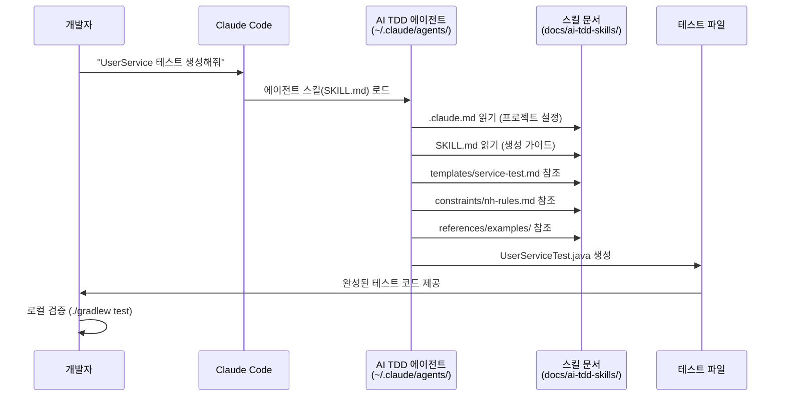
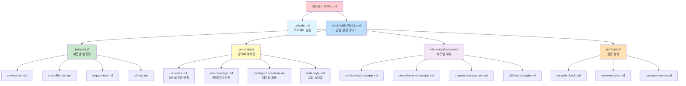

# AI TDD 시스템 - 적용 가이드

이 문서는 AI TDD 시스템을 **프로젝트에 적용하려는 개발자**를 위한 설치 및 사용법 가이드입니다.
AI TDD 시스템은 Claude Code 에이전트와 스킬 문서 세트를 활용하여 Spring Boot 프로젝트의 테스트 코드를 자동 생성합니다.

---

## 1. 시스템 개요

### 1.1. 구성 요소

AI TDD 시스템은 **두 가지 핵심 폴더**로 구성됩니다.

| 폴더 | 역할 | 설치 위치 |
|---|---|---|
| `ai-tdd-agent/` | Claude Code **테스트 생성 에이전트** 정의 | `~/.claude/agents/ai-tdd-agent/` |
| `ai-tdd-review-agent/` | 생성된 테스트의 **품질 검증 에이전트** 정의 | `~/.claude/agents/ai-tdd-review-agent/` |
| `ai-tdd-skills/` | 에이전트가 참조하는 **규칙/템플릿/예제** 문서 | 프로젝트 `docs/ai-tdd-skills/` |

- **ai-tdd-agent**: Claude Code가 "테스트 생성" 요청을 받으면 실행되는 에이전트의 동작 방식, 역할, 판단 기준을 정의
- **ai-tdd-skills**: 에이전트가 테스트를 생성할 때 참조하는 템플릿, 규칙, 예제, 검증 절차 문서 모음

### 1.2. 동작 흐름



### 1.3. 폴더 구조 (이 저장소)

```
docs/ai-tdd/
├── README.md                  ← 이 문서 (적용 가이드)
│
├── ai-tdd-agent/              ← 에이전트 스킬 (Claude Code에 설치)
│   ├── SKILL.md               # 테스트 생성 에이전트
│   └── batch-execution.md     # 배치(다중 클래스) 실행 가이드
│
├── ai-tdd-review-agent/       ← 리뷰 에이전트 (생성된 테스트 품질 검증)
│   └── SKILL.md
│
├── ai-tdd-skills/             ← 스킬 문서 세트 (프로젝트에 복사)
│   ├── .claude.md             # 프로젝트 설정 (커스터마이징 필요)
│   ├── SKILL.md               # 공통 생성 가이드
│   ├── document-guide.md      # 문서 가이드 (문서 간 관계 설명)
│   ├── templates/             # 계층별 테스트 템플릿
│   │   ├── service-test.md
│   │   ├── controller-test.md
│   │   ├── mapper-test.md
│   │   └── util-test.md
│   ├── constraints/           # 규칙 및 제약사항
│   │   ├── nh-rules.md
│   │   ├── test-coverage.md
│   │   ├── naming-conventions.md
│   │   └── code-style.md
│   ├── references/            # 참고자료 및 예제
│   │   └── examples/
│   │       ├── service-test-example.md
│   │       ├── controller-test-example.md
│   │       ├── mapper-test-example.md
│   │       └── util-test-example.md
│   └── verification/          # 검증 절차
│       ├── compile-check.md
│       ├── test-execution.md
│       ├── coverage-report.md
│       └── performance-report.md  # 도입 성과 리포트 템플릿
│
└── plan/                      ← 기획/설계 문서 (배포 대상 아님)
    ├── PRD-AI-TDD.md
    ├── 2026-02-09-compare-ai-tdd.md
    ├── 2026-02-10-prd-ai-tdd.md
    └── 2026-02-11-trd-ai-tdd.md
```

---

## 2. 설치 절차

### 2.1. 에이전트 스킬 설치

에이전트 스킬 파일을 Claude Code 에이전트 폴더로 복사합니다.

```bash
# ai-tdd-agent 폴더 전체를 Claude 에이전트 경로에 복사
cp -r docs/ai-tdd/ai-tdd-agent/ ~/.claude/agents/ai-tdd-agent/
```

설치 후 위치:
```
~/.claude/agents/ai-tdd-agent/
└── SKILL.md        # 에이전트가 동작할 때 참조하는 스킬 정의
```

### 2.2. 스킬 문서 세트 복사

대상 프로젝트의 `docs/` 하위에 스킬 문서를 복사합니다.

```bash
# ai-tdd-skills 폴더를 대상 프로젝트에 복사
cp -r docs/ai-tdd/ai-tdd-skills/ /path/to/your-project/docs/ai-tdd-skills/
```

복사 후 대상 프로젝트 구조:
```
your-project/
├── .claude/
│   └── agents/
│       └── ai-tdd-agent/
│           └── SKILL.md           ← 2.1에서 설치됨
├── docs/
│   └── ai-tdd-skills/             ← 2.2에서 복사됨
│       ├── .claude.md
│       ├── SKILL.md
│       ├── templates/
│       ├── constraints/
│       ├── references/
│       └── verification/
└── src/
    ├── main/java/                 ← 소스 코드
    └── test/java/                 ← 생성된 테스트 코드
```

### 2.3. 프로젝트별 설정 (.claude.md 커스터마이징)

복사한 `docs/ai-tdd-skills/.claude.md`를 프로젝트에 맞게 수정합니다.

**수정이 필요한 항목:**

| 항목 | 설명 | 예시 |
|---|---|---|
| Project Name | 프로젝트 이름 | `로그트래커` |
| Framework | 프레임워크 버전 | `Spring Boot 2.7.17` |
| Language | 언어/버전 | `Java 1.8` |

> 나머지 항목(Testing Framework, Coverage Tool, Skills Structure 등)은 기본값 유지

---

## 3. 사용 방법

### 3.1. 테스트 생성 요청

Claude Code에서 다음과 같이 요청합니다:

```
"UserService 테스트 코드 생성해줘"
```
```
"UserController에 대한 테스트 코드 생성"
```
```
"UserMapper 인터페이스 테스트 코드 만들어줘"
```

에이전트가 자동으로:
1. 소스 코드를 분석하고 클래스 유형(Service/Controller/Mapper/Util)을 판별
2. 해당 템플릿(`templates/`)과 규칙(`constraints/`)을 참조
3. 4단계 테스트 레벨에 따라 테스트 코드를 생성

### 3.2. 4단계 테스트 레벨

에이전트는 다음 4단계 비율로 테스트를 생성합니다:

| 레벨 | 비율 | 목적 | 예시 |
|---|---|---|---|
| Level 1: Happy Case | 40% | 정상 케이스 검증 | 유효한 요청으로 사용자 생성 성공 |
| Level 2: Edge Case | 30% | 경계값/Null/Empty | ID가 null이면 예외 발생 |
| Level 3: Exception | 20% | 비즈니스/DB/시스템 예외 | 중복 이메일 → DuplicateEmailException |
| Level 4: Mutation | 10% | 숨겨진 버그, 조건분기 | 비밀번호 인코딩 호출 여부 검증 |

### 3.3. 테스트 검증

생성된 테스트는 반드시 로컬에서 검증합니다:

```bash
# 1. 컴파일 검증
./gradlew compileTestJava

# 2. 테스트 실행
./gradlew test

# 3. 커버리지 보고서 생성
./gradlew test jacocoTestReport
```

---

## 4. 예제

4개 계층별 완전한 예제가 `references/examples/`에 제공됩니다.

### 4.1. 예제 파일 목록

| 파일 | 대상 계층 | 테스트 어노테이션 | 테스트 수 |
|---|---|---|---|
| `service-test-example.md` | `@Service` (UserService) | `@ExtendWith(MockitoExtension.class)` | 15개 |
| `controller-test-example.md` | `@RestController` (UserController) | `@WebMvcTest` + MockMvc | 13개 |
| `mapper-test-example.md` | `@Mapper` (UserMapper) | Mock 기반 + `@MybatisTest` DB 연동 | 18개 |
| `util-test-example.md` | Utility (MaskingUtil) | 순수 JUnit 5 + `@ParameterizedTest` | 21개 |

각 예제는 **소스 클래스 + 완전한 테스트 클래스 + 예제 해설**로 구성되며, 4단계 레벨을 모두 포함합니다.

### 4.2. 간단 예시: Service 테스트 (발췌)

```java
@ExtendWith(MockitoExtension.class)
class UserServiceTest {

    @Mock
    private UserMapper userMapper;

    @Mock
    private PasswordEncoder passwordEncoder;

    @Mock
    private AuditLogService auditLogService;

    @InjectMocks
    private UserService userService;

    // ── Level 1: Happy Case (40%) ──

    @Test
    @DisplayName("유효한 요청으로 사용자 생성 성공")
    void should_createUser_when_validRequest() {
        // Given
        CreateUserRequest request = new CreateUserRequest("테스트사용자", "test@example.com", "testPassword");
        when(userMapper.findByEmail(request.getEmail())).thenReturn(null);
        when(passwordEncoder.encode(request.getPassword())).thenReturn("encryptedValue");

        // When
        User result = userService.createUser(request);

        // Then
        assertThat(result).isNotNull();
        assertThat(result.getName()).isEqualTo("테스트사용자");
        verify(userMapper).insert(any(User.class));
    }

    // ── Level 2: Edge Case (30%) ──

    @Test
    @DisplayName("ID가 null이면 InvalidUserIdException 발생")
    void should_throwException_when_idIsNull() {
        // When & Then
        assertThatThrownBy(() -> userService.getUserById(null))
            .isInstanceOf(InvalidUserIdException.class);
    }

    // ── Level 3: Exception (20%) ──

    @Test
    @DisplayName("중복 이메일이면 DuplicateEmailException 발생")
    void should_throwException_when_emailIsDuplicate() {
        // Given
        CreateUserRequest request = new CreateUserRequest("테스트사용자", "test@example.com", "testPassword");
        when(userMapper.findByEmail(request.getEmail())).thenReturn(new User());

        // When & Then
        assertThatThrownBy(() -> userService.createUser(request))
            .isInstanceOf(DuplicateEmailException.class)
            .hasMessage("이미 존재하는 이메일입니다");
    }

    // ── Level 4: Mutation Testing (10%) ──

    @Test
    @DisplayName("사용자 생성 시 비밀번호가 Petra 암호화됨")
    void should_encryptPassword_when_creatingUser() {
        // Given
        CreateUserRequest request = new CreateUserRequest("테스트사용자", "test@example.com", "testPassword");
        when(userMapper.findByEmail(request.getEmail())).thenReturn(null);
        when(passwordEncoder.encode("testPassword")).thenReturn("encryptedValue");

        // When
        userService.createUser(request);

        // Then - Petra 암호화 호출 + 평문 미저장 검증
        verify(passwordEncoder).encode("testPassword");
        ArgumentCaptor<User> captor = ArgumentCaptor.forClass(User.class);
        verify(userMapper).insert(captor.capture());
        assertThat(captor.getValue().getPassword()).isNotEqualTo("testPassword");
    }
}
```

> 전체 코드(15개 테스트)와 다른 계층 예제는 `references/examples/` 폴더를 참조하세요.

---

## 5. 스킬 문서 참조 체계

에이전트가 테스트를 생성할 때 참조하는 문서의 역할입니다.

### 5.1. 참조 흐름



### 5.2. 각 폴더 역할

| 폴더 | 역할 | 공통화 수준 |
|---|---|---|
| `.claude.md` | 프로젝트별 설정 (이름, 프레임워크 등) | 프로젝트마다 커스터마이징 |
| `SKILL.md` | 4단계 테스트 레벨, 생성 가이드 | 100% 공통 |
| `templates/` | 계층별(Service/Controller/Mapper/Util) 테스트 템플릿 | 100% 공통 |
| `constraints/` | NH 규칙, 커버리지 기준, 네이밍/스타일 | 90% 공통 (도메인 규칙만 추가) |
| `references/` | 계층별 완전한 예제 (Service/Controller/Mapper/Util) | 80% 공통 (프로젝트별 예시 추가 가능) |
| `verification/` | 컴파일/실행/커버리지 검증 절차 | 100% 공통 |

---

## 6. 주요 기능

1. **자동 테스트 생성**: 4단계 테스트 레벨(Happy/Edge/Exception/Mutation) 기반
2. **자동 품질 검증**: 리뷰 에이전트가 생성된 테스트의 품질을 정량 평가
3. **배치 실행**: 패키지/폴더 단위 다중 클래스 일괄 테스트 생성
4. **NH 규칙 준수**: 개인정보 마스킹, Petra 암호화, 감사로그 등 도메인 규칙 적용
5. **포괄적 커버리지**: 80% 이상 라인 커버리지 목표
6. **성과 측정**: 도입 전후 정량 지표 비교 리포트 자동 생성
7. **에이전트 기반**: Claude Code 에이전트로 프롬프트 작성 없이 바로 사용
8. **프로젝트별 맞춤형**: `.claude.md`만 수정하여 즉시 적용 가능

---

## 7. 주의사항

1. **에이전트 설치 필수**: `~/.claude/agents/ai-tdd-agent/SKILL.md`가 설치되어 있어야 에이전트가 동작합니다
2. **스킬 문서 경로**: 대상 프로젝트의 `docs/ai-tdd-skills/`에 복사해야 에이전트가 참조할 수 있습니다
3. **프로젝트 설정 수정**: `.claude.md` 파일의 Project Name, Framework, Language를 프로젝트에 맞게 수정하세요
4. **검증 필수**: 생성된 테스트는 반드시 `./gradlew test`로 로컬 검증 후 커밋하세요
5. **Claude Code 환경**: GPToss MCP 서버 기반으로 동작하며, 외부 AI와 결과가 다를 수 있습니다
