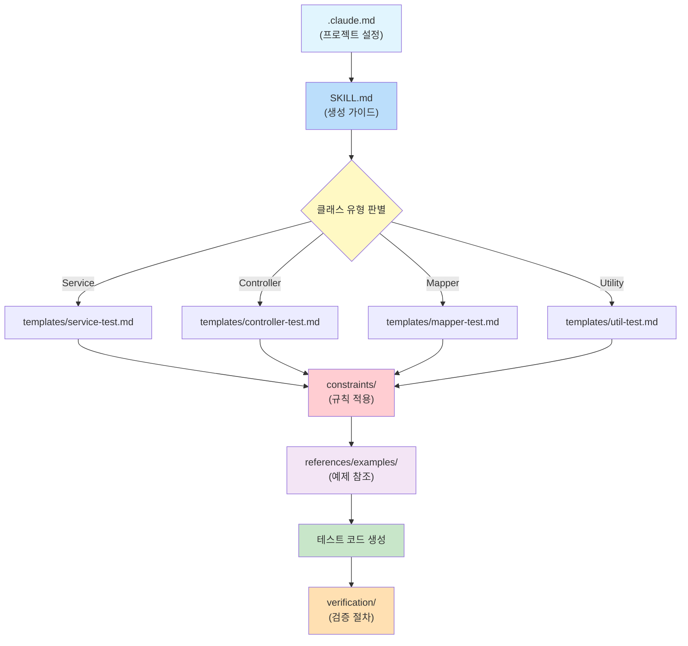

# AI TDD 스킬 문서 가이드

이 문서는 `ai-tdd-skills/` 폴더 내 모든 문서의 **역할, 핵심 내용, 관계, 커스터마이징 방법**을 설명합니다.
프로젝트에 스킬 세트를 적용할 때 이 가이드를 참고하세요.

---

## 1. 문서 구조 및 참조 흐름

### 1.1. 폴더 구조

```
docs/ai-tdd-skills/
├── .claude.md                  # 프로젝트 설정 (커스터마이징 포인트)
├── SKILL.md                    # 공통 생성 가이드 (핵심)
├── document-guide.md           # 이 문서 (문서 가이드)
├── templates/                  # 계층별 테스트 템플릿
│   ├── service-test.md
│   ├── controller-test.md
│   ├── mapper-test.md
│   └── util-test.md
├── constraints/                # 규칙 및 제약사항
│   ├── nh-rules.md
│   ├── test-coverage.md
│   ├── naming-conventions.md
│   └── code-style.md
├── references/                 # 참고자료 및 예제
│   └── examples/
│       ├── service-test-example.md
│       ├── controller-test-example.md
│       ├── mapper-test-example.md
│       └── util-test-example.md
└── verification/               # 검증 절차
    ├── compile-check.md
    ├── test-execution.md
    └── coverage-report.md
```

### 1.2. 에이전트 참조 흐름

에이전트가 테스트를 생성할 때 문서를 참조하는 순서입니다.



---

## 2. 각 문서별 상세

### 2.1. `.claude.md` - 프로젝트 설정

| 항목 | 내용 |
|---|---|
| **역할** | 에이전트가 가장 먼저 읽는 프로젝트 설정 파일 |
| **핵심 내용** | 프로젝트명, 프레임워크/JDK 버전, 패키지 구조, 테스트 프레임워크, AI 환경 |
| **커스터마이징** | **필수** - `[수정필요]` 표시 항목을 프로젝트에 맞게 변경 |
| **참조 대상** | 에이전트가 직접 참조 |

**수정 필요 항목**: 프로젝트명, 프레임워크 버전, JDK 버전, 빌드 도구 버전, 기본 패키지

### 2.2. `SKILL.md` - 공통 생성 가이드

| 항목 | 내용 |
|---|---|
| **역할** | 테스트 생성의 **핵심 가이드** (생성 프로세스 전체를 정의) |
| **핵심 내용** | 클래스 유형 판별 기준, 4단계 테스트 레벨(비율/패턴/예시), 규칙 적용 순서, 생성 결과물 표준 구조, 검증 기준 |
| **커스터마이징** | 불필요 (100% 공통) |
| **참조 대상** | 에이전트가 직접 참조 |

### 2.3. `templates/` - 계층별 테스트 템플릿

각 Spring 계층에 맞는 테스트 생성 지시문(역할, 컨텍스트, 요구사항, 출력형식, 제약사항)을 정의합니다.

| 파일 | 대상 | 판별 기준 | 테스트 방식 |
|---|---|---|---|
| `service-test.md` | `@Service`, `@Component` | 비즈니스 로직 클래스 | `@ExtendWith(MockitoExtension.class)` + `@Mock` 단위테스트 |
| `controller-test.md` | `@RestController`, `@Controller` | REST API 클래스 | `@WebMvcTest` + MockMvc 통합테스트 |
| `mapper-test.md` | `@Mapper`, MyBatis 인터페이스 | DB 접근 클래스 | `@MybatisTest` 또는 Mock 기반 |
| `util-test.md` | static 메서드, Helper | 유틸리티 클래스 | 어노테이션 없이 직접 호출 |

**커스터마이징**: 불필요 (100% 공통, Spring Boot 표준)

### 2.4. `constraints/` - 규칙 및 제약사항

에이전트가 테스트 생성 시 준수해야 하는 규칙입니다. **적용 우선순위 순서**로 나열합니다.

| 순서 | 파일 | 핵심 내용 | 커스터마이징 |
|---|---|---|---|
| 1 | `nh-rules.md` | 데이터 보호(PII 마스킹), Petra 암호화, 감사로그, 보안 프로토콜, 하드코딩 금지 | 도메인 규칙 추가 가능 |
| 2 | `naming-conventions.md` | 클래스명(`{도메인}Service`), 메서드명(`should_{동작}_when_{조건}`), 변수/상수/패키지 규칙 | 불필요 |
| 3 | `code-style.md` | 들여쓰기 4칸, 줄 120자, import 순서, Given-When-Then 패턴, `@DisplayName` 사용 | 불필요 |
| 4 | `test-coverage.md` | 라인 80% / 분기 70% / 메서드 100% / 클래스 100%, JaCoCo + PIT | 기준값 조정 가능 |

### 2.5. `references/examples/` - 참고 예제

4개 계층별 완전한 예제가 제공됩니다. 각 예제는 소스 클래스 + 테스트 클래스 + 해설로 구성됩니다.

| 파일 | 대상 계층 | 핵심 패턴 |
|---|---|---|
| `service-test-example.md` | `@Service` (UserService) | `@Mock` + `@InjectMocks`, verify, ArgumentCaptor, InOrder, 감사로그 |
| `controller-test-example.md` | `@RestController` (UserController) | `@WebMvcTest` + MockMvc, HTTP 상태코드, jsonPath, ObjectMapper |
| `mapper-test-example.md` | `@Mapper` (UserMapper) | Mock 기반 + `@MybatisTest` DB 연동, `@Sql`, CRUD 패턴 |
| `util-test-example.md` | Utility (MaskingUtil) | `@ParameterizedTest`, `@CsvSource`, NH 마스킹 검증 |

**커스터마이징**: 프로젝트별 추가 예시 파일 생성 가능

### 2.6. `verification/` - 검증 절차

테스트 생성 후 품질을 검증하는 3단계 절차입니다.

| 순서 | 파일 | 명령어 | 합격 기준 |
|---|---|---|---|
| 1 | `compile-check.md` | `./gradlew compileTestJava` | 컴파일 오류 0건 |
| 2 | `test-execution.md` | `./gradlew test` | 모든 테스트 PASS |
| 3 | `coverage-report.md` | `./gradlew test jacocoTestReport` | 라인 80%, 분기 70% 이상 |

**커스터마이징**: 불필요 (100% 공통)

---

## 3. 공통화 수준 요약

프로젝트에 적용할 때 수정이 필요한 파일과 그대로 사용하는 파일을 구분합니다.

| 파일/폴더 | 공통화 | 프로젝트별 작업 |
|---|---|---|
| `.claude.md` | 템플릿 | **`[수정필요]` 항목 변경** (프로젝트명, 버전, 패키지) |
| `SKILL.md` | 100% 공통 | 수정 불필요 |
| `document-guide.md` | 100% 공통 | 수정 불필요 |
| `templates/` | 100% 공통 | 수정 불필요 |
| `constraints/nh-rules.md` | 90% 공통 | 도메인 특화 규칙 추가 가능 |
| `constraints/` (나머지) | 100% 공통 | 수정 불필요 |
| `constraints/test-coverage.md` | 90% 공통 | 커버리지 기준값 조정 가능 |
| `references/examples/` | 80% 공통 | 4개 계층 예제 제공, 프로젝트별 추가 가능 |
| `verification/` | 100% 공통 | 수정 불필요 |

---

## 4. 문서 업데이트 가이드

### 4.1. 업데이트가 필요한 경우

| 상황 | 대상 문서 | 작업 |
|---|---|---|
| 새 프로젝트에 적용 | `.claude.md` | `[수정필요]` 항목 변경 |
| 도메인 규칙 추가 | `constraints/nh-rules.md` | 규칙 항목 추가 |
| 커버리지 기준 변경 | `constraints/test-coverage.md` | 기준값 수정 |
| 새 계층 유형 추가 | `templates/` | 새 템플릿 파일 생성 |
| 예제 추가 | `references/examples/` | 새 예시 파일 생성 |

### 4.2. 업데이트 시 주의사항

- `SKILL.md`와 `templates/`는 전체 프로젝트에 영향을 미치므로 **공통 저장소에서 관리**
- 프로젝트별 변경은 `.claude.md`와 `references/`에 한정하는 것을 권장
- 규칙 변경 시 기존 테스트와의 호환성 확인 필요
