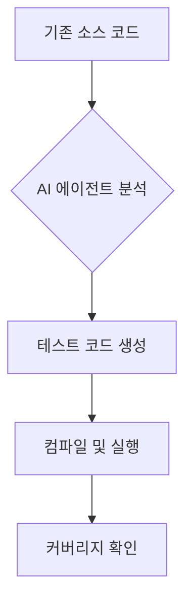
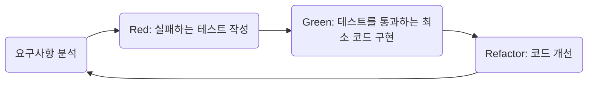
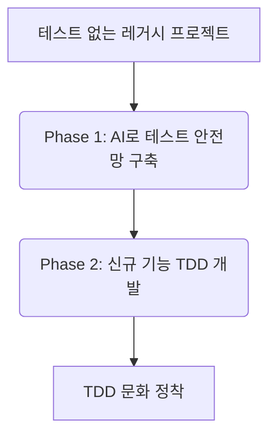
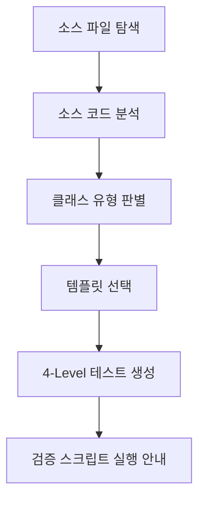
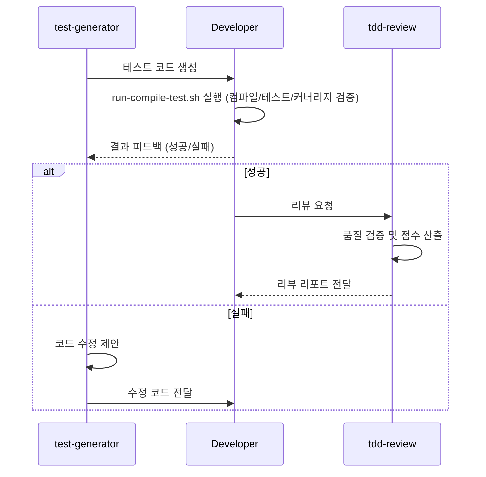
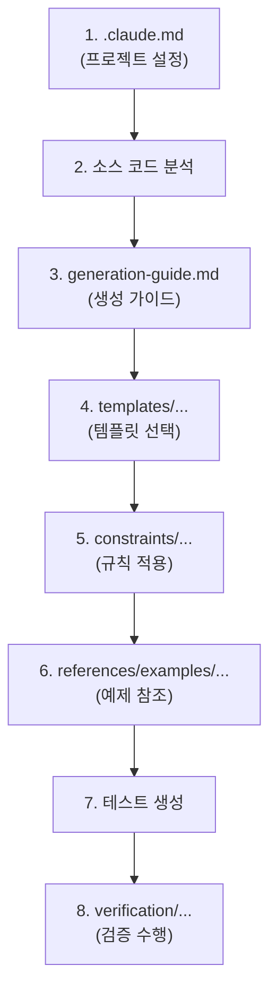
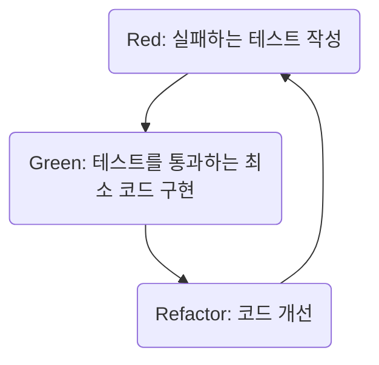

# 레거시 프로젝트 AI TDD 도입 가이드

> **대상**: 이미 구현된 프로젝트에 AI 에이전트를 활용하여 테스트 코드를 생성하고, TDD 문화를 도입하려는 개발자
>
> **전제**: Claude Code 설치 완료, 폐쇄망 환경

---

## 1. 테스트 코드의 필요성

### 1.1. 레거시 프로젝트의 현실

레거시 프로젝트에서는 다음과 같은 우려사항이 흔히 발생합니다.

> "이 코드를 수정했을 때, 다른 기능에 영향을 주지 않을까요?"

이러한 불확실성은 아래와 같은 문제로 이어질 수 있습니다.

| 문제 | 원인 | 결과 |
|---|---|---|
| **변경의 어려움** | 수정 시 발생하는 사이드이펙트 예측 불가 | 코드 수정을 회피하게 되고, 기술 부채가 누적됨 |
| **수동 검증 비용 증가** | 모든 변경사항을 사람이 직접 테스트 | 배포 주기가 길어지고, 반복적인 작업에 리소스 소모 |
| **회귀 버그 발생** | 기존에 잘 동작하던 기능이 새로운 코드 변경으로 인해 오작동 | 잦은 핫픽스 발생 및 시스템 신뢰도 하락 |
| **높은 온보딩 장벽** | 신규 입사자가 코드의 의도와 동작을 파악하기 어려움 | 팀 전체의 생산성 저하로 이어짐 |

### 1.2. 테스트 자동화의 이점

자동화된 테스트 코드는 **코드의 안정성을 확보하는 중요한 수단**입니다.

- **변경에 대한 자신감**: 코드 수정 후 테스트를 실행하면, 의도치 않은 사이드이펙트를 즉시 감지할 수 있습니다.
- **자동화된 회귀 검증**: 빌드 및 배포 파이프라인에 통합하여, 기존 기능이 항상 정상적으로 동작하는지 자동으로 확인할 수 있습니다.
- **살아있는 문서**: 테스트 코드 자체가 "이 메서드는 이런 조건에서 이렇게 동작해야 한다"는 명확한 명세서 역할을 합니다.
- **안전한 리팩토링 지원**: 테스트가 코드의 동작을 보장하므로, 안심하고 코드 구조를 개선할 수 있습니다.

### 1.3. AI 에이전트 활용의 필요성

레거시 프로젝트에 테스트 코드를 수동으로 추가하는 것은 다음과 같은 현실적인 어려움이 있습니다.

| 기존 수동 방식 | AI 에이전트 활용 |
|---|---|
| 소스 코드를 읽고 비즈니스 로직을 이해하는 데 많은 시간이 소요됨 | 소스 코드를 자동으로 분석하여 로직을 파악 |
| 모든 테스트 패턴을 매번 직접 구성해야 함 | 표준화된 템플릿 기반으로 일관된 테스트 생성 |
| 개발자마다 테스트 코드의 스타일이 다를 수 있음 | 코드 스타일 규칙을 100% 준수하여 일관성 유지 |
| Mock 객체 설정, 어설션 구문 작성에 많은 시간이 소요됨 | 생성부터 검증까지의 과정을 자동화 |
| 많은 수의 클래스에 대한 테스트를 작성하는 데 수일 또는 수주가 소요됨 | 수분에서 수십 분 내에 테스트 생성 가능 |

---

## 2. TDD 도입 목표 및 범위

본 가이드는 AI TDD 도입을 위한 **두 단계의 로드맵**으로 구성됩니다.

### Phase 1: 기존 소스에 테스트 코드 생성 (Test-After)

AI 에이전트를 활용하여, 이미 구현된 코드에 대한 테스트를 자동으로 생성하고 안정성을 확보하는 단계입니다.



### Phase 2: 신규 기능을 TDD로 개발 (Test-First)

테스트라는 안전망이 구축된 후, 새로운 기능을 추가할 때는 테스트를 먼저 작성하는 TDD 방식으로 개발을 진행합니다.



### 최종 목표

궁극적인 목표는 테스트가 없는 레거시 프로젝트를 TDD 문화가 정착된 건강한 프로젝트로 전환하는 것입니다.



---

## 3. AI TDD 환경 설정 가이드

### 3.1. 프로젝트에 에이전트 파일 배치

Claude Code의 에이전트(Agent)는 `.claude/agents/` 디렉토리에 마크다운 파일로 정의합니다. 에이전트 파일은 AI 에이전트의 **역할과 행동 방식**을 정의하는 지시서입니다.

프로젝트 루트에 다음 파일들을 배치합니다.

```
{프로젝트 루트}/
├── .claude/
│   └── agents/
│       ├── test-generator.md     ← 테스트 생성 에이전트
│       └── tdd-review.md         ← 테스트 리뷰 에이전트
```

### 3.2. 에이전트 역할 및 동작 방식

이 프로젝트에서는 **2개의 전문 에이전트**가 역할을 분담합니다.

#### test-generator (테스트 생성 에이전트)

| 항목 | 내용 |
|---|---|
| **역할** | Java 소스 코드를 분석하여 JUnit 5 테스트 코드를 자동 생성 |
| **입력** | 클래스명 (예: `UserService`) |
| **출력** | 완성된 테스트 파일 (`UserServiceTest.java`) |

**동작 흐름**:



#### tdd-review (테스트 리뷰 에이전트)

| 항목 | 내용 |
|---|---|
| **역할** | 생성된 테스트 코드의 품질을 검증하고 점수를 매김 |
| **입력** | 테스트 클래스명 (예: `UserServiceTest`) |
| **출력** | 100점 만점 리뷰 리포트 (A~F 등급) |

**검증 영역**:

| 영역 | 배점 | 검증 항목 |
|---|---|---|
| 구조 검증 | 30점 | 4-Level 구조, Given-When-Then, @Nested, 테스트 수 |
| 품질 검증 | 40점 | AssertJ, Mock 정확성, verify, @DisplayName, 독립성 |
| NH 규칙 | 30점 | PII 마스킹, 더미 데이터, 어노테이션 적정 사용 |

**등급 기준**: A(90+) 우수 / B(80~89) 양호 / C(70~79) 보통 / D(60~69) 미흡 / F(60 미만) 불합격

> **참고: `tdd-review` 에이전트의 한계**
> 이 에이전트는 코드의 구조, 스타일, 표준 패턴 준수 여부를 훌륭하게 검증합니다. 하지만, **비즈니스 로직의 미묘한 의미까지는 파악할 수 없습니다.** 예를 들어, 할인율을 10%로 검증해야 하는데 5%로 잘못 작성된 테스트는 찾아내지 못합니다. 최종적인 비즈니스 로직의 정확성은 항상 개발자가 직접 검토하고 책임져야 합니다.

#### 에이전트 간 협업 흐름



### 3.3. 스킬 문서 배치 (docs/ai-tdd-skills/)

스킬 문서는 AI 에이전트가 테스트 코드를 생성할 때 참조하는 **지식 베이스**입니다. 에이전트는 이 문서들을 통해 따를 규칙과 적용할 패턴을 학습합니다.

프로젝트에 다음 구조로 복사합니다.

```
{프로젝트 루트}/
└── docs/
    └── ai-tdd-skills/
        ├── .claude.md                ← [커스터마이징 필요] 프로젝트 설정
        ├── generation-guide.md       ← 생성 가이드 (4-Level, 판별 기준)
        ├── document-guide.md         ← 문서 체계 설명
        │
        ├── templates/                ← 계층별 테스트 템플릿
        │   ├── service-test.md           Service 단위테스트
        │   ├── controller-test.md        Controller 슬라이스 테스트
        │   ├── mapper-test.md            Mapper Mock/DB 테스트
        │   └── util-test.md              Utility 순수 테스트
        │
        ├── constraints/              ← 규칙 및 제약사항
        │   ├── nh-rules.md               NH 도메인 특화 규칙 (최우선)
        │   ├── naming-conventions.md     네이밍 규칙
        │   ├── code-style.md             코드 스타일
        │   └── test-coverage.md          커버리지 기준
        │
        ├── references/examples/      ← 참고 예제
        │   ├── service-test-example.md
        │   ├── controller-test-example.md
        │   ├── mapper-test-example.md
        │   └── util-test-example.md
        │
        └── verification/             ← 검증 절차
            ├── compile-check.md          컴파일 검증
            ├── test-execution.md         테스트 실행 검증
            └── coverage-report.md        커버리지 검증
```

**에이전트의 문서 참조 순서**:



### 3.4. 프로젝트 설정 파일 작성 (.claude.md)

`docs/ai-tdd-skills/.claude.md` 파일에서 `[수정필요]` 항목을 프로젝트에 맞게 변경합니다.

```markdown
## 프로젝트 정보

| 항목 | 값 | 비고 |
|---|---|---|
| 프로젝트명 | 내 프로젝트명 | `[수정필요]` |
| 프레임워크 버전 | 2.7.17 | `[수정필요]` |
| JDK 버전 | 1.8 | `[수정필요]` |
| 빌드 도구 버전 | 6.8.3 | `[수정필요]` |

## 프로젝트 구조

| 항목 | 경로 | 비고 |
|---|---|---|
| 기본 패키지 | `com.nhcard.al.demo` | `[수정필요]` 실제 패키지로 변경 |
```

### 3.5. 빌드 설정 (JaCoCo, PIT)

테스트 커버리지 측정과 뮤테이션 테스트를 위한 플러그인을 `build.gradle`에 추가합니다.

#### JaCoCo 설정 (커버리지 측정)
> **참고**: JaCoCo 라이브러리는 현재 반입 진행 중입니다. 반입 완료 전까지는 관련 설정과 검증 단계를 임시로 건너뛰십시오.
```groovy
plugins {
    id 'jacoco'
}

jacoco {
    toolVersion = "0.8.7"
}

jacocoTestReport {
    reports {
        xml.enabled = true
        html.enabled = true
    }
}

jacocoTestCoverageVerification {
    violationRules {
        rule {
            limit {
                counter = 'LINE'
                minimum = 0.80      // 라인 커버리지 80%
            }
            limit {
                counter = 'BRANCH'
                minimum = 0.70      // 분기 커버리지 70%
            }
        }
    }
}
```

#### PIT 설정 (뮤테이션 테스트, 선택사항)

```groovy
plugins {
    id 'info.solidsoft.pitest' version '1.7.4'
}

pitest {
    targetClasses = ['com.nhcard.al.demo.*']    // 프로젝트 패키지에 맞게 변경
    targetTests = ['com.nhcard.al.demo.*']
    mutationThreshold = 65
    outputFormats = ['HTML']
}
```

### 3.6. 에이전트 동작 확인

모든 파일을 배치한 후, Claude Code에서 에이전트가 정상 인식되는지 확인합니다.

```bash
# 1. 프로젝트 디렉토리에서 Claude Code 실행
claude

# 2. 에이전트 목록 확인 (목록 확인용, 에이전트 호출과는 무관)
/agents
```

다음과 같이 표시되면 정상입니다.

```
❯ Create new agent

  Project agents (~\{프로젝트}\  .claude\agents)
  test-generator · inherit
  tdd-review · inherit
```

> **참고**: `/agents` 명령어는 에이전트 **목록 확인 및 생성/수정**용입니다. 에이전트를 호출하는 방법은 다음 절(3.7)을 참조하세요.

### 3.7. 에이전트 사용법

#### 핵심: 에이전트는 설치만 하면 바로 사용 가능

`.claude/agents/` 디렉토리에 에이전트 파일이 배치되어 있으면, Claude Code가 자동으로 인식합니다.
별도의 선택 과정 없이 **에이전트 이름과 함께 입력하면 바로 실행**됩니다.

> 참고: `/agents` 명령어는 에이전트 파일을 **생성/수정**할 때 사용하는 것이지, 에이전트를 호출하는 방법이 아닙니다.

#### 한 줄로 테스트 생성

Claude Code 프롬프트에 다음과 같이 입력합니다:

```bash
> test-generator, UserService.java
```

#### 다양한 입력 방식

| 입력 | 설명 |
|---|---|
| `test-generator, UserService.java` | 클래스명만으로 테스트 생성 (가장 간단) |
| `test-generator, UserService 테스트 코드 생성` | 한국어 지시와 함께 |
| `test-generator, service 패키지 전체 테스트 코드 생성` | 패키지 단위 배치 생성 |
| `test-generator, UserService 커버리지 미달 영역 추가 테스트` | 보충 테스트 생성 |

#### 심화: 생성된 코드 수정 및 보강하기 (교정 프롬프트)

최초 생성 후, 테스트를 수정하거나 보강하고 싶을 때는 구체적인 '교정 프롬프트'를 사용할 수 있습니다.

| 목적 | 프롬프트 예시 |
|---|---|
| **특정 로직 추가** | `test-generator, UserServiceTest의 deleteUser 테스트에 userMapper.delete가 호출되었는지 verify하는 로직을 추가해줘` |
| **시나리오 보강** | `test-generator, UserServiceTest에 사용자가 이미 존재하는 경우에 대한 예외 처리 테스트를 보강해줘` |
| **특정 테스트 재생성** | `test-generator, UserServiceTest의 should_registerUser_when_validRequest 테스트만 다시 생성해줘. 이번에는 비밀번호 암호화 검증을 포함해줘.` |

---

## 4. Phase 1: 기존 소스 테스트 생성 (Test-After)

### 4.1. 대상 클래스 선정

모든 클래스를 한번에 테스트 코드를 생성하기 보다는, 다음 우선순위에 따라 점진적으로 진행하는 것을 권장합니다.

| 순서 | 대상 | 이유 |
|---|---|---|
| 1 | **Utility 클래스** | 의존성이 없어 가장 테스트하기 용이하며, 빠른 성공 경험을 제공 |
| 2 | **Service 클래스** | 핵심 비즈니스 로직이 포함되어 있어, 테스트 자동화의 효과가 가장 큼 |
| 3 | **Controller 클래스** | HTTP 요청/응답 레이어를 검증하여 API 안정성 확보 |
| 4 | **Mapper 클래스** | 데이터베이스 접근 로직 검증 (Mock 기반 테스트 우선) |

### 4.2. 단일 클래스 테스트 생성 실습

**예시**: `UserService` 클래스의 테스트를 생성합니다.

#### Step 1: 에이전트 호출

`test-generator` 에이전트를 호출하여 `UserService`에 대한 테스트 코드를 생성합니다.

```bash
> test-generator, UserService.java
```

에이전트가 `src/test/java/.../service/UserServiceTest.java` 파일을 생성할 것입니다.

#### Step 2: 생성된 테스트 코드 검증 (컴파일, 실행, 커버리지)

생성된 테스트 코드의 컴파일, 실행 및 커버리지를 한 번에 검증합니다.

```bash
./docs/ai-tdd-skills/verification/run-compile-test.sh com.nhcard.al.demo.service.UserService
```

> **만약 스크립트가 컴파일 오류로 실패했다면?**
>
> `cannot find symbol`과 같은 컴파일 오류는 AI가 `import` 구문을 누락했을 가능성이 높습니다. 당황하지 마세요.
>
> 1.  생성된 테스트 파일(`UserServiceTest.java`)을 열어 IDE의 자동 `import` 기능(단축키: `Option`+`Enter` 또는 `Alt`+`Enter`)을 사용해 간단히 해결해 보세요.
> 2.  해결 후, 다시 검증 스크립트를 실행하여 통과하는지 확인합니다.
>
> 이처럼 간단한 오류는 직접 수정하는 것이 더 빠를 수 있습니다. 다른 종류의 오류는 6장(트러블슈팅)을 참조하세요.

#### Step 3: 생성된 테스트 코드 평가 및 학습

이제 `src/test/java/.../service/UserServiceTest.java` 경로에 생성된 실제 테스트 코드를 열어보고, 다음 평가 기준에 따라 AI가 생성한 코드의 품질을 분석하고 학습해 봅시다. 이는 AI의 결과물을 맹신하는 것이 아닌, 비판적으로 검토하고 개선점을 파악하는 데 필수적인 과정입니다.

##### **계층별 핵심 평가 포인트**

AI가 생성한 테스트 코드를 리뷰할 때는 해당 코드가 어떤 계층의 테스트인지 파악하고, 아래의 계층별 핵심 포인트를 중점적으로 확인해야 합니다.

##### **1. Service 계층 테스트 (비즈니스 로직의 정확성 검증)**

> **목표:** 외부 의존성을 완벽히 차단하고, 순수하게 서비스 클래스 내부의 **비즈니스 로직**이 모든 조건(분기, 예외 등)에 따라 정확하게 동작하는지 검증합니다.

| 핵심 평가 포인트 | 상세 설명 |
| :--- | :--- |
| **의존성 완벽 격리** | `Mapper`, `Repository`, 다른 `Service` 등 모든 외부 의존성이 `@Mock`으로 처리되었는가? |
| **비즈니스 로직 검증** | `if/else`, `for`, `switch` 등 모든 분기문을 통과하는 시나리오가 테스트되는가? (Edge Case) |
| **상태 vs 행위 검증** | **(상태)** 값을 반환하는 메서드는 `assertThat`으로 반환 값을 검증하는가? <br> **(행위)** `void` 메서드는 `verify`를 사용해 의존 객체의 메서드 호출 여부를 검증하는가? |
| **예외 시나리오 처리** | 비즈니스 규칙에 따라 `Exception`을 던지는 모든 경로에 대해 `assertThatThrownBy`로 검증하는가? |
| **트랜잭션 경계** | (심화) 트랜잭션이 필요한 메서드에 `@Transactional`이 선언되어 있고, 테스트에서는 롤백이 잘 동작하는가? |

##### **2. Controller 계층 테스트 (API 명세와 입출력 검증)**

> **목표:** HTTP 요청부터 응답까지의 흐름을 격리하여 테스트합니다. Controller의 역할은 "요청을 잘 받고, Service에 잘 위임하며, 결과를 올바른 HTTP 응답으로 잘 변환하는가"에 있으므로, **비즈니스 로직은 절대 테스트하지 않습니다.**

| 핵심 평가 포인트 | 상세 설명 |
| :--- | :--- |
| **Web Layer 격리** | `@WebMvcTest`를 사용하여 웹 계층 관련 빈만 로드하고, `@MockBean`으로 `Service`를 Mock 처리했는가? |
| **HTTP 요청 모사** | `MockMvc`를 사용하여 `get()`, `post()`, `put()`, `delete()` 등 실제 HTTP 요청을 보내는가? |
| **HTTP 응답 상태 검증** | `.andExpect(status().isOk())`, `.isCreated()`, `.isNotFound()` 등으로 정확한 HTTP 상태 코드를 반환하는지 검증하는가? |
| **Request/Response Body 검증** | (Request) `JSON` 요청 본문을 직렬화하여 보내는가? <br> (Response) `jsonPath()`를 사용해 응답 `JSON`의 특정 필드 값을 검증하는가? |
| **입력 유효성 검증** | `@Valid`와 관련된 잘못된 요청(예: 필드 누락) 시, `400 Bad Request` 상태를 반환하는지 테스트하는가? |

##### **3. Mapper/Repository 계층 테스트 (데이터베이스 연동 검증)**

> **목표:** 작성된 SQL 쿼리가 실제 데이터베이스(또는 내장 DB)와 상호작용하여 의도대로 데이터를 조회, 생성, 수정, 삭제하는지 검증합니다. **Mock을 사용하지 않는 통합 테스트**입니다.

| 핵심 평가 포인트 | 상세 설명 |
| :--- | :--- |
| **DB 테스트 환경** | `@MybatisTest` 또는 `@DataJpaTest`를 사용하고, 테스트용 내장 데이터베이스(H2 등)로 실행되는가? |
| **실제 객체 주입** | `@Autowired`로 실제 `Mapper` 객체를 주입받는가? (Mock 객체가 아님) |
| **C.R.U.D 검증** | 데이터를 `insert`한 후, `findById`로 조회하여 필드 값이 일치하는지 검증하는가? `update` 후에도 동일하게 검증하는가? `delete` 후에는 조회 시 `null`이 반환되는지 검증하는가? |
| **반환 값 검증** | `List`를 반환하는 쿼리가 데이터가 없을 때 빈 리스트(`isEmpty()`)를 반환하는지, 단일 객체를 반환하는 쿼리가 데이터가 없을 때 `null`을 반환하는지 검증하는가? |
| **쿼리 조건 검증** | `WHERE` 절의 조건(예: `findByName`)이 정확하게 동작하여 원하는 데이터만 필터링하는지 검증하는가? |

##### **4. Util/Domain 계층 테스트 (순수 로직 및 핵심 규칙 검증)**

> **목표:** 프레임워크나 외부 의존성 없이, 특정 로직(계산, 포맷팅 등)이나 도메인 객체의 핵심 규칙이 순수하게 동작하는지 검증합니다. 가장 빠르고 간단한 단위 테스트입니다.

| 핵심 평가 포인트 | 상세 설명 |
| :--- | :--- |
| **순수 JUnit 테스트** | Spring이나 Mockito 의존성 없이, 순수 `JUnit`만으로 테스트가 작성되었는가? |
| **경계값(Edge Case) 집중**| `null`, `0`, 빈 문자열/리스트, 최대/최소값 등 비정상적이거나 극단적인 입력 값에 대해 의도대로 동작하는지 집중적으로 테스트하는가? |
| **다양한 입력 값 테스트** | `@ParameterizedTest`를 사용하여 여러 개의 다른 입력과 그에 따른 예상 결과를 한 번에 테스트하여 효율성을 높였는가? |
| **불변성(Immutability)** | (Domain) 객체의 상태를 변경하는 메서드를 호출했을 때, 기존 객체가 아닌 새로운 상태의 객체를 반환하는가? (필요시) |

#### Step 4: (선택) 리뷰 에이전트로 품질 확인

`tdd-review` 에이전트를 사용하여 생성된 테스트의 품질을 2차적으로 검증하고, 개선점을 찾아볼 수 있습니다.

```bash
> tdd-review, UserServiceTest 리뷰
```

---

## 5. Phase 2: 신규 기능 TDD 개발 (Test-First)

Phase 1에서 기존 코드에 테스트 안전망을 구축했다면, 이제 새로운 기능을 추가할 때는 **TDD(Test-Driven Development)** 방식으로 개발합니다.

### 5.1. Red-Green-Refactor 사이클 (실패-통과-개선)

TDD는 **3단계 사이클**을 반복하는 개발 방법론입니다.



| 단계 | 행동 | 상태 |
|---|---|---|
| **Red** | 테스트를 먼저 작성 → 실행하면 실패 (구현이 없으니까) | 빨간불 |
| **Green** | 테스트를 통과하는 **최소한의** 코드 구현 | 초록불 |
| **Refactor** | 테스트가 통과하는 상태를 유지하면서 코드 개선 | 초록불 유지 |

### 5.2. 시나리오: 기존 프로젝트에 "즐겨찾기" 기능 TDD로 추가

> **참고**: 아래는 TDD 프로세스를 설명하기 위한 **가상의 시나리오**입니다.

기존 데모 프로젝트에 **사용자가 공지사항을 즐겨찾기하는 기능**을 TDD로 개발합니다.

#### 요구사항

```
- 사용자가 공지사항을 즐겨찾기에 추가할 수 있다
- 사용자가 자신의 즐겨찾기 목록을 조회할 수 있다
- 사용자가 즐겨찾기를 삭제할 수 있다
- 이미 즐겨찾기한 공지사항을 다시 추가하면 예외 발생
```

#### Step 1: Red — 테스트 먼저 작성

에이전트에게 요구사항을 주고 `FavoriteService`에 대한 테스트 코드를 먼저 생성합니다. 아직 구현 코드가 없으므로, 생성된 테스트를 검증 스크립트로 실행하면 컴파일 오류로 **Red** 상태가 됩니다.

```bash
> test-generator, FavoriteService 테스트 코드 생성

요구사항:
- 사용자가 공지사항을 즐겨찾기에 추가할 수 있다
- 사용자가 자신의 즐겨찾기 목록을 조회할 수 있다
- 사용자가 즐겨찾기를 삭제할 수 있다
- 이미 즐겨찾기한 공지사항을 다시 추가하면 예외 발생
```

생성된 테스트 코드를 검증 스크립트로 실행하여 **Red** 상태를 확인합니다.

```bash
./docs/ai-tdd-skills/verification/run-compile-test.sh com.nhcard.al.demo.service.FavoriteService
```

#### Step 2: Green — 최소 구현

`Favorite` 엔티티, `FavoriteMapper` 인터페이스, `FavoriteService` 구현 등 테스트를 통과시키기 위한 **최소한의 코드**를 작성합니다.

작성을 완료한 후, 다시 검증 스크립트를 실행하여 **Green** 상태를 확인합니다.

```bash
./docs/ai-tdd-skills/verification/run-compile-test.sh com.nhcard.al.demo.service.FavoriteService
```

#### Step 3: Refactor — 코드 개선

테스트가 통과하는 상태를 유지하면서 코드를 개선합니다. (예: 유효성 검증 추가, 메서드명 개선, 중복 제거 등)

리팩토링 후 반드시 검증 스크립트를 재실행하여 **Green** 상태를 유지하는지 확인합니다.

```bash
./docs/ai-tdd-skills/verification/run-compile-test.sh com.nhcard.al.demo.service.FavoriteService
```

이 사이클을 반복하여 나머지 기능(목록 조회, 삭제)도 완성합니다.

---

## 6. 트러블슈팅 및 FAQ

### Q1. 에이전트가 소스 파일을 못 찾아요

-   **원인**: 패키지 구조가 표준과 다르거나, 소스 경로가 다를 수 있습니다.
-   **해결**: `docs/ai-tdd-skills/.claude.md`의 "기본 패키지" 항목을 확인하고 프로젝트에 맞게 수정합니다.

### Q2. 생성된 테스트가 컴파일 실패해요

-   **원인**: import 누락, 의존성 타입 불일치 등이 원인일 수 있습니다.
-   **해결**: `run-compile-test.sh` 스크립트의 출력 메시지를 자세히 확인하고, 필요한 경우 다음 명령어로 수동 컴파일을 시도하여 상세 오류를 파악하십시오.
    ```bash
    ./gradlew compileTestJava
    ```
    오류 메시지를 에이전트에게 전달하여 수정 요청하거나, `verification/compile-check.md` 문서를 참조하십시오.

### Q3. 커버리지가 목표에 미달해요

-   **원인**: 예외 경로, else 분기 등이 테스트에서 누락되었을 수 있습니다.
-   **해결**: 에이전트에게 "커버리지 미달 영역 추가 테스트 생성"을 요청합니다. `verification/coverage-report.md`의 미달 시 조치 흐름을 참조할 수 있습니다.

### Q4. Mock 설정이 실제 코드와 안 맞아요

-   **원인**: 소스 코드가 변경된 후 테스트가 아직 업데이트되지 않았을 수 있습니다.
-   **해결**: 에이전트에게 해당 클래스의 테스트 재생성을 요청합니다.

### Q5. 에이전트가 동작하지 않아요

-   **원인**: 파일 위치나 형식에 오류가 있을 수 있습니다.
-   **해결**:
    1.  `.claude/agents/` 디렉토리가 프로젝트 루트에 존재하는지 확인합니다.
    2.  에이전트 파일의 확장자가 `.md`인지 확인합니다.
    3.  파일 상단에 YAML frontmatter(`---` 블록)가 올바르게 작성되었는지 확인합니다.
    4.  Claude Code에서 `/agents` 명령어로 에이전트 목록에 정상적으로 표시되는지 확인합니다.

### Q6. 폐쇄망에서 Gradle 의존성을 받지 못해요

-   **원인**: 인터넷이 차단된 개발 환경 때문입니다.
-   **해결**: 사내 Nexus/Artifactory와 같은 아티팩트 저장소에 필요한 의존성을 사전 등록해야 합니다. 필요한 의존성 목록은 `docs/closed-network-dependencies.md`를 참조하십시오.

---

## 7. TDD 문화 확산 전략

### 7.1. 팀 도입 단계별 로드맵

| 단계 | 기간 | 목표 | 행동 |
|---|---|---|---|
| **1단계: 파일럿** | 1~2주 | 핵심 인원 1~2명이 도구 익히기 | 이 가이드에 따라 실습 진행 |
| **2단계: 확산** | 2~4주 | 팀 전체에 적용 | 기존 코드에 대해 Phase 1을 진행하고, 팀의 커버리지 목표 설정 |
| **3단계: 습관화** | 1~2개월 | 신규 기능 개발 시 TDD 적용 | Phase 2를 적용하고, 코드 리뷰에 테스트 코드 포함 |
| **4단계: 문화** | 3개월~ | TDD를 기본 개발 방식으로 정착 | "테스트 없는 코드는 머지 불가"와 같은 팀 정책 수립 |

### 7.2. 코드 리뷰에 테스트 포함 기준

Pull Request(PR) 시 다음 항목을 체크리스트로 활용할 수 있습니다.

-   [ ] 신규/수정된 코드에 대응하는 테스트 코드가 포함되었는가?
-   [ ] 모든 테스트가 통과하는가? (`./gradlew test`)
-   [ ] 프로젝트에서 정한 라인 커버리지 기준(예: 80%)을 충족하는가?
-   [ ] `tdd-review` 에이전트의 리뷰 점수가 B등급(80점) 이상인가?

### 7.3. 점진적 도입 전략

> "처음부터 완벽한 커버리지를 목표로 할 필요는 없습니다."

먼저 가장 중요하고 핵심적인 `Service` 클래스부터 시작하고, 변경이 잦은 코드 위주로 테스트를 추가해나가는 것이 좋습니다. 새로운 기능이나 코드를 작성할 때는 반드시 테스트와 함께 작성하는 습관을 들이는 것이 중요합니다.

**100% 커버리지가 아닌 "어제보다 나은 커버리지"를 만드는 것이 현실적인 목표입니다.**

### 7.4. AI 스킬 문서 개선 프로세스

AI 에이전트의 성능은 `docs/ai-tdd-skills`에 포함된 스킬 문서의 품질에 직접적인 영향을 받습니다. 팀 전체가 이 지식 베이스를 지속적으로 개선해 나가는 것이 중요합니다.

1.  **문제 발견**: `test-generator`가 특정 패턴을 반복적으로 잘못 생성하거나, 특정 규칙을 누락하는 것을 발견합니다.
2.  **팀 논의**: 발견된 문제를 팀과 공유하고, 어떤 스킬 문서(예: `templates/service-test.md` 또는 `constraints/nh-rules.md`)를 어떻게 개선할지 논의하여 합의합니다.
3.  **스킬 문서 수정 및 PR**: 담당자가 합의된 내용에 따라 스킬 문서를 수정한 후, 변경 사항에 대한 Pull Request(PR)를 생성합니다.
4.  **동료 리뷰**: 코드 리뷰와 동일하게, 다른 팀원들이 스킬 문서의 변경 내용이 적절한지 리뷰합니다.
5.  **병합 및 전파**: 리뷰가 완료되면 마스터 브랜치에 병합하여 모든 팀원이 개선된 AI 스킬을 사용할 수 있도록 합니다.
