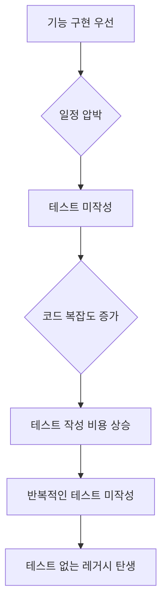
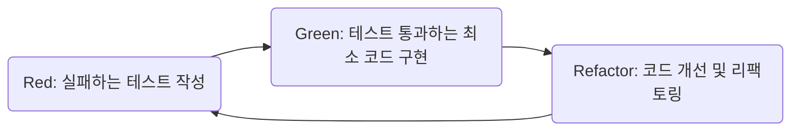

# 신규 프로젝트 TDD 도입 가이드

> **대상**: 새로운 프로젝트를 시작하면서 처음부터 TDD를 적용하려는 개발자
>
> **전제**: Claude Code 설치 완료, 폐쇄망 환경

---

**최종 업데이트**: 2026년 3월 23일

---

## 목차
1.  [TDD 도입의 필요성](#1-tdd-도입의-필요성)
    1.  [테스트 후 작성 방식의 문제점](#11-테스트-후-작성-방식의-문제점)
    2.  [TDD를 통한 설계 개선 원리](#12-tdd를-통한-설계-개선-원리)
    3.  [AI 에이전트와 함께하는 TDD의 시너지](#13-ai-에이전트와-함께하는-tdd의-시너지)
2.  [TDD 핵심 사이클 및 AI 역할](#2-tdd-핵심-사이클-및-ai-역할)
    1.  [Red-Green-Refactor 핵심 사이클](#21-red-green-refactor-핵심-사이클)
    2.  [TDD 각 단계에서의 AI 에이전트 역할](#22-tdd-각-단계에서의-ai-에이전트-역할)
    3.  [TDD 도입의 궁극적인 목표](#23-tdd-도입의-궁극적인-목표)
3.  [TDD 환경 설정 가이드](#3-tdd-환경-설정-가이드)
    1.  [신규 프로젝트 생성 및 기본 구성](#31-신규-프로젝트-생성-및-기본-구성)
    2.  [AI 에이전트 파일 배치](#32-ai-에이전트-파일-배치)
    3.  [스킬 문서 배치](#33-스킬-문서-배치)
    4.  [프로젝트 설정 파일 작성 (.claude.md)](#34-프로젝트-설정-파일-작성-claude-md)
    5.  [빌드 설정](#35-빌드-설정)
    6.  [에이전트 사용법](#36-에이전트-사용법)
4.  [게시판 CRUD TDD 실습](#4-게시판-crud-tdd-실습)
    1.  [요구사항 정의](#41-요구사항-정의)
    2.  [Service 계층 TDD (Red-Green-Refactor)](#42-service-계층-tdd-red-green-refactor)
    3.  [Controller 및 Mapper 계층 TDD](#43-controller-및-mapper-계층-tdd)
    4.  [(선택) 리뷰 에이전트로 품질 확인](#44-선택-리뷰-에이전트로-품질-확인)
    5.  [생성된 테스트 코드 평가 가이드](#45-생성된-테스트-코드-평가-가이드)
    6.  [심화 학습: Outside-In TDD (인수 테스트 주도 개발)](#46-심화-학습-outside-in-tdd-인수-테스트-주도-개발)
5.  [TDD 실전 팁](#5-tdd-실전-팁)
    1.  [테스트 작성 우선순위](#51-테스트-작성-우선순위)
    2.  [효과적인 AI 에이전트 프롬프트 작성법](#52-효과적인-ai-에이전트-프롬프트-작성법)
    3.  [테스트가 설계를 이끄는 사례](#53-테스트가-설계를-이끄는-사례)
6.  [트러블슈팅 및 FAQ](#6-트러블슈팅-및-faq)
    1.  [Q1. Red 단계에서 테스트가 이미 통과해요](#q1-red-단계에서-테스트가-이미-통과해요)
    2.  [Q2. 구현 코드 없이 테스트만 있으면 에이전트가 혼란스러워해요](#q2-구현-코드-없이-테스트만-있으면-에이전트가-혼란스러워해요)
    3.  [Q3. 어디까지 테스트해야 하나요?](#q3-어디까지-테스트해야-하나요)
    4.  [Q4. TDD가 오히려 더 느린 것 같아요](#q4-tdd가-오히려-더-느린-것-같아요)
    5.  [Q5. 폐쇄망에서 의존성을 못 받아요](#q5-폐쇄망에서-의존성을-못-받아요)
7.  [TDD 문화 확산 전략](#7-tdd-문화-확산-전략)
    1.  [팀 컨벤션 수립](#71-팀-컨벤션-수립)
    2.  [CI/CD 파이프라인에 테스트 게이트 추가](#72-cicd-파이프라인에-테스트-게이트-추가)
    3.  [TDD 문화 성숙도 레벨](#73-tdd-문화-성숙도-레벨)
    4.  [AI 스킬 문서 개선 프로세스](#74-ai-스킬-문서-개선-프로세스)

---

> **대상**: 새로운 프로젝트를 시작하면서 처음부터 TDD를 적용하려는 개발자
>
> **전제**: Claude Code 설치 완료, 폐쇄망 환경

---

## 1. TDD 도입의 필요성

### 1.1. 테스트 후 작성 방식의 문제점

많은 프로젝트에서 "일단 기능 먼저 만들고, 나중에 테스트를 추가하자"는 계획을 세웁니다. 하지만 대부분 다음과 같은 흐름으로 이어집니다.



이러한 방식은 다음과 같은 문제점을 유발하며, TDD는 이에 대한 효과적인 해결책을 제시합니다.

| "나중에" 방식의 문제점 | TDD 방식의 해결책 |
|---|---|
| 구현 후 테스트를 작성하면, 테스트하기 어려운 코드가 이미 완성되는 경향이 있음 | 테스트를 먼저 작성함으로써, 자연스럽게 테스트하기 쉬운 구조의 코드 설계가 유도됨 |
| 테스트 작성이 "추가적인 작업"으로 인식되어 우선순위에서 밀리기 쉬움 | 테스트가 개발 프로세스의 필수적인 부분으로 통합되어 별도의 시간 할애가 불필요 |
| 테스트 없이 배포되어 버그 발생 시, 핫픽스 및 재작업 비용이 증가 | 테스트가 회귀를 방지하여 안정적인 배포를 가능하게 함 |

### 1.2. TDD를 통한 설계 개선 원리

TDD의 핵심 가치는 "테스트가 설계를 이끈다"는 것입니다. "테스트를 먼저 작성한다"는 것은 개발될 코드가 **"어떻게 사용될 것인지 먼저 고민한다"**는 의미와 같습니다.

테스트를 먼저 작성함으로써 자연스럽게 다음과 같은 설계상의 이점을 얻을 수 있습니다.
- **인터페이스 중심 설계**: 구현이 아닌 코드 사용자의 관점에서 인터페이스를 먼저 설계하게 됩니다.
- **주입 가능한 의존성**: Mock 객체로 의존성을 대체해야 하므로, 의존성 주입이 용이한 구조를 갖추게 됩니다.
- **단일 책임 원칙 준수**: 하나의 테스트는 하나의 검증에 집중하므로, 자연스럽게 클래스나 메서드가 단일 책임을 갖도록 유도됩니다.
- **불필요한 코드 제거**: 테스트가 요구하는 최소한의 기능만을 구현하게 되어, 과도한 설계나 불필요한 코드 작성을 방지합니다.

### 1.3. AI 에이전트와 함께하는 TDD의 시너지

TDD 도입의 가장 큰 진입 장벽 중 하나는 **"테스트 코드를 매번 직접 작성하는 데 필요한 시간과 노력"**입니다. AI 에이전트는 이 병목 현상을 효과적으로 해결하여 TDD의 이점을 극대화합니다.

| TDD 단계 | 기존 개발 방식 | AI 에이전트 활용 시 |
|---|---|---|
| **Red** (테스트 작성) | 개발자가 수동으로 테스트 코드 작성 (시간 소요) | AI 에이전트가 요구사항을 분석하여 테스트 코드 자동 생성 |
| **Green** (구현) | 개발자가 테스트를 통과하는 코드 구현 | 개발자가 구현 (이 단계는 사람의 설계 주도권 유지) |
| **Refactor** (개선) | 수동으로 코드 리팩토링 및 검증 | `tdd-review` 에이전트가 코드 품질 검증 및 개선점 제안 |

결과적으로 AI 에이전트의 도움으로 **TDD의 핵심 이점(설계 개선, 품질 향상)은 유지하면서도, 테스트 코드 작성 및 검증에 드는 시간과 비용을 획기적으로 절감**할 수 있습니다.

---

## 2. TDD 핵심 사이클 및 AI 역할

### 2.1. Red-Green-Refactor 핵심 사이클

TDD는 짧은 주기의 다음 세 단계를 빠르게 반복하는 개발 방법론입니다.



**사이클의 중요 규칙**:\
- **Red 단계**: 작성한 테스트가 처음에는 반드시 실패함을 **확인**해야 합니다. (이미 통과하는 테스트는 실질적인 검증 효과가 없기 때문입니다.)\
- **Green 단계**: 테스트를 통과시키는 **최소한의 코드**만을 작성해야 합니다. (과도한 구현은 피합니다.)\
- **Refactor 단계**: 코드 개선(리팩토링) 후에도 테스트가 **계속 통과**하는지 반드시 확인해야 합니다.

### 2.2. TDD 각 단계에서의 AI 에이전트 역할

| 단계 | AI 에이전트 역할 |
|---|---|
| **Red** | 요구사항을 분석하여 테스트 코드를 자동으로 생성합니다. (개발자는 테스트 시나리오 구상에 집중) |\
| **Green** | 기능 구현 코드 작성은 개발자가 직접 수행합니다. (코드의 설계 및 구현 주도권은 사람에게 유지) |\
| **Refactor** | `tdd-review` 에이전트가 생성된 코드의 품질을 검증하고, 개선이 필요한 부분을 제안합니다. (개발자는 리팩토링 방향 설정에 집중) |

### 2.3. TDD 도입의 궁극적인 목표

신규 프로젝트에 TDD를 도입하는 궁극적인 목표는 **"테스트 없는 코드는 미완성 코드"**라는 인식을 팀의 기본 개발 문화로 정착시키는 것입니다.

---

## 3. TDD 환경 설정 가이드

### 3.1. 신규 프로젝트 생성 및 기본 구성

Spring Boot 프로젝트를 생성합니다 (Spring Initializr 또는 사내 아키타입 사용). 프로젝트 생성 시 다음 기술 스택을 참고할 수 있습니다.

```
기술 스택 (예시):
- Java 1.8
- Spring Boot 2.7.x
- Gradle 6.8.3
- MyBatis
- H2 (개발/테스트용)
```

프로젝트 기본 구조는 다음과 같습니다.

```
board-project/
├── src/main/java/com/nhcard/al/board/
│   ├── BoardApplication.java
│   ├── config/
│   ├── controller/
│   ├── service/
│   ├── mapper/
│   ├── domain/
│   ├── dto/
│   └── exception/
├── src/main/resources/
│   ├── application.yml
│   ├── schema.sql
│   └── mapper/
├── src/test/java/com/nhcard/al/board/
└── build.gradle
```

### 3.2. AI 에이전트 파일 배치

Claude Code의 에이전트(Agent)는 `.claude/agents/` 디렉토리에 마크다운 파일로 정의합니다. 에이전트 파일은 AI 에이전트의 **역할과 행동 방식**을 정의하는 지시서입니다.

프로젝트 루트에 다음 파일들을 배치합니다.

```
{프로젝트 루트}/
├── .claude/
│   └── agents/
│       ├── test-generator.md     ← 테스트 생성 에이전트
│       └── tdd-review.md         ← 테스트 리뷰 에이전트
```

### 3.3. 스킬 문서 배치

스킬 문서는 AI 에이전트가 테스트 코드를 생성할 때 참조하는 **지식 베이스**입니다. 에이전트는 이 문서들을 통해 따를 규칙과 적용할 패턴을 학습합니다.

프로젝트에 다음 구조로 복사합니다.

```
{프로젝트 루트}/
└── docs/
    └── ai-tdd-skills/
        ├── .claude.md                ← [커스터마이징 필요] 프로젝트 설정
        ├── generation-guide.md       ← 생성 가이드 (4-Level, 판별 기준)
        ├── document-guide.md         ← 문서 체계 설명
        │
        ├── templates/                ← 계층별 테스트 템플릿
        │   ├── service-test.md           Service 단위테스트
        │   ├── controller-test.md        Controller 슬라이스 테스트
        │   ├── mapper-test.md            Mapper Mock/DB 테스트
        │   └── util-test.md              Utility 순수 테스트
        │
        ├── constraints/              ← 규칙 및 제약사항
        │   ├── nh-rules.md               NH 도메인 특화 규칙 (최우선)
        │   ├── naming-conventions.md     네이밍 규칙
        │   ├── code-style.md             코드 스타일
        │   └── test-coverage.md          커버리지 기준
        │
        ├── references/examples/      ← 참고 예제
        │   ├── service-test-example.md
        │   ├── controller-test-example.md
        │   ├── mapper-test-example.md
        │   └── util-test-example.md
        │
        └── verification/             ← 검증 절차
            ├── compile-check.md          컴파일 검증
            ├── test-execution.md         테스트 실행 검증
            └── coverage-report.md        커버리지 검증
```

### 3.4. 프로젝트 설정 파일 작성 (.claude.md)

`docs/ai-tdd-skills/.claude.md` 파일에서 `[수정필요]` 항목을 프로젝트에 맞게 변경합니다.

```markdown
## 프로젝트 정보

| 항목 | 값 | 비고 |
|---|---|---|
| 프로젝트명 | Board Project | `[수정필요]` |
| 기본 패키지 | `com.nhcard.al.board` | `[수정필요]` |
| 프레임워크 버전 | 2.7.17 | `[수정필요]` |
| JDK 버전 | 1.8 | `[수정필요]` |
```

### 3.5. 빌드 설정

`build.gradle`에 테스트 관련 의존성과 플러그인을 추가합니다.

> **참고**: JaCoCo 라이브러리는 현재 반입 진행 중입니다. 반입 완료 전까지는 관련 설정과 검증 단계를 임시로 건너뛰십시오.
```groovy
plugins {
    id 'java'
    id 'jacoco'
    id 'org.springframework.boot' version '2.7.17'
    id 'io.spring.dependency-management' version '1.0.15.RELEASE'
}

sourceCompatibility = '1.8'
targetCompatibility = '1.8'

// 테스트 의존성
dependencies {
    testImplementation 'org.springframework.boot:spring-boot-starter-test'
}

// JaCoCo 설정
jacoco {
    toolVersion = "0.8.7"
}

jacocoTestReport {
    reports {
        xml.enabled = true
        html.enabled = true
    }
}

jacocoTestCoverageVerification {
    violationRules {
        rule {
            limit {
                counter = 'LINE'
                minimum = 0.80
            }
            limit {
                counter = 'BRANCH'
                minimum = 0.70
            }
        }
    }
}
```

### 3.6. 에이전트 사용법

#### 에이전트 호출 기본

`.claude/agents/` 디렉토리에 에이전트 파일이 배치되어 있으면, Claude Code가 자동으로 인식합니다. 별도의 선택 과정 없이 **에이전트 이름과 함께 프롬프트를 입력하면 바로 실행**됩니다.

신규 프로젝트 TDD에서는 아직 소스 코드가 없는 상태이므로, **요구사항과 함께** AI 에이전트를 호출하는 것이 핵심입니다.

> **중요**: 신규 프로젝트 TDD 성공의 핵심은 AI에게 **'잘 정의된 요구사항'**을 제공하는 것입니다. 요구사항이 명확하고 상세할수록, AI는 여러분의 설계 의도를 더 정확하게 반영한 테스트 코드를 생성해 줍니다.

```bash
> test-generator, BoardService 테스트 코드 생성

요구사항:
- 게시글 등록: 제목, 내용, 작성자를 입력받아 게시글 생성
- 게시글 조회: ID로 조회 (조회수 자동 증가)
- 게시글 목록: 전체 목록 조회
- 게시글 수정: 제목, 내용 수정
- 게시글 삭제: ID로 삭제
- 존재하지 않는 게시글 접근 시 예외 발생
```

#### 심화: 생성된 코드 수정 및 보강하기 (교정 프롬프트)

최초 생성 후, 테스트를 수정하거나 보강하고 싶을 때는 구체적인 '교정 프롬프트'를 사용할 수 있습니다.

| 목적 | 프롬프트 예시 |
|---|---|
| **특정 로직 추가** | `test-generator, BoardServiceTest의 deleteBoard 테스트에 boardMapper.delete가 호출되었는지 verify하는 로직을 추가해줘` |
| **시나리오 보강** | `test-generator, BoardServiceTest에 존재하지 않는 게시글을 수정하려 할 때 예외가 발생하는 테스트를 보강해줘` |
| **특정 테스트 재생성** | `test-generator, BoardServiceTest의 should_createBoard_when_validRequest 테스트만 다시 생성해줘. 이번에는 author 필드가 비어있을 때의 검증을 포함해줘.` |

---

## 4. 게시판 CRUD TDD 실습

### 4.1. 요구사항 정의

게시판(Board) 기본 CRUD 기능을 TDD로 개발합니다.

```
기능 요구사항:
  1. 게시글 등록: 제목, 내용, 작성자를 입력받아 게시글을 생성한다
  2. 게시글 조회: ID로 게시글을 조회한다 (조회수 자동 증가)
  3. 게시글 목록: 전체 게시글 목록을 조회한다
  4. 게시글 수정: 제목, 내용을 수정한다
  5. 게시글 삭제: ID로 게시글을 삭제한다
  6. 예외처리: 존재하지 않는 게시글 조회/수정/삭제 시 예외 발생
```

### 4.2. Service 계층 TDD (Red-Green-Refactor)

테스트 주도 개발은 Service 계층부터 시작하는 것이 핵심적인 접근 방식입니다.

#### **Step 1: Red — 실패하는 테스트 작성 (AI로 강화된 방식)**

테스트 주도 개발(TDD)의 첫 단계는 **실패하는 테스트를 작성**하는 것입니다. 신규 프로젝트에서는 이 단계에서 AI 에이전트의 역할이 매우 중요합니다.

AI 에이전트에게 요구사항을 전달하여 `BoardService`에 대한 테스트 코드를 생성합니다. 이때, AI는 두 가지 방식으로 구현 코드를 생성할 수 있습니다.

> **AI의 코드 생성 범위: 참고 소스 유무에 따라 달라집니다**
>
> AI가 생성하는 구현 코드의 상세 수준은 프로젝트의 기존 코드, 즉 **참고할 만한 소스가 있는지 여부**에 따라 달라집니다.
>
> **시나리오 1: 참고할 코드가 없는 경우 (완전히 새로운 기능 개발)**
> 프로젝트 내에 유사한 패턴의 코드가 없다면, AI는 기능의 기본 구조만 갖춘 **스켈레톤(skeleton) 코드**를 생성합니다. (예: 비어있는 메서드를 가진 서비스 클래스) 이는 고전적인 TDD 방식과 유사하며, 개발자가 구현의 시작점을 잡는 데 도움을 줍니다.
>
> **시나리오 2: 참고할 코드가 있는 경우 (기존 기능 확장 또는 유사 기능 개발)**
> 이 경우 AI는 한 걸음 더 나아가, 프로젝트 내의 다른 소스 코드를 참고하여 **스켈레톤을 넘어 실제 구현 로직까지 생성**해낼 수 있습니다. 예를 들어, 다른 서비스의 CRUD 패턴을 학습하여 간단한 로직을 구현하거나, 필요한 Entity 클래스를 생성해버리기도 합니다.
>
> **가장 중요한 점: 두 시나리오 모두 개발자의 검토가 필수입니다!**
> AI가 생성한 구현 코드는 어떤 경우든 **검증되지 않은 '초안'**일 뿐이며, **반드시 개발자가 직접 전체 코드를 검토하고 수정해야 합니다.** 비즈니스 규칙의 정확성, 예외 처리의 적절성, 보안 측면 등을 꼼꼼히 확인하는 과정이 필수적입니다. 이 점을 인지하지 못하면 예상치 못한 버그가 발생할 수 있으니 각별히 주의해야 합니다.

```bash
> test-generator, BoardService 테스트 코드 생성

요구사항:
- 게시글 등록: 제목, 내용, 작성자를 입력받아 게시글 생성
- 게시글 조회: ID로 조회 (조회수 자동 증가)
- 게시글 목록: 전체 목록 조회
- 게시글 수정: 제목, 내용 수정
- 게시글 삭제: ID로 삭제
- 존재하지 않는 게시글 접근 시 예외 발생
```

에이전트가 `src/test/java/.../service/BoardServiceTest.java` 파일을 생성할 것입니다. 이와 함께 `BoardService.java`, `Board.java` 등의 구현 클래스와 엔티티도 함께 생성될 수 있습니다.

이제, 생성된 테스트 코드를 검증 스크립트로 실행하여 테스트가 **의도대로 실패하는지(Red 상태)** 확인합니다. AI가 구현 코드까지 생성한 경우에도 핵심 비즈니스 로직의 정확성이 보장되지 않으므로 어설션(assertion) 단계에서 실패하거나, 혹은 잘못된 로직으로 인해 우연히 통과할 수 있습니다. 기능적으로 완전하지 않거나 검증되지 않은 이 상태가 바로 우리가 목표하는 **'Red'** 상태입니다.

```bash
./docs/ai-tdd-skills/verification/run-compile-test.sh com.nhcard.al.board.service.BoardService
```

> **이것이 올바른 `Red` 상태입니다! (강화된 Red)**
>
> 이제는 단순히 컴파일 오류가 아닌, **AI가 생성한 구현 코드가 비즈니스 요구사항을 완벽히 만족하지 않아서 발생하는 기능적 실패를 'Red'로 간주**합니다. 이 의도된 실패는 **"이제 이 테스트를 통과시킬 코드를 검토하고 완성해야 한다"**는 명확한 개발 목표를 제시합니다.

`Red` 단계에서 AI가 생성한 `BoardServiceTest.java`와 `BoardService.java`, `Board.java` 등의 파일을 열어보세요. 이 코드는 우리가 앞으로 만들어야 할 코드가 **어떻게 사용되기를 기대하는지** 보여주는 "살아있는 설계도"입니다. 4.5절의 **"계층별 핵심 평가 포인트"** 가이드를 참조하여, 생성된 테스트 및 구현 코드가 각 계층의 역할을 잘 정의하고 있는지 미리 검토하고 학습하십시오. 특히 AI가 생성한 구현 코드는 초안이므로, TDD 사이클을 통해 점진적으로 완성해 나가야 함을 잊지 마십시오.

#### **Step 2: Green — 테스트를 통과하는 최소 코드 작성**

이제 **Red** 상태의 테스트를 통과시킬 수 있는 **최소한의 구현 코드**를 작성합니다. `Board`, `CreateBoardRequest`, `BoardMapper` 인터페이스, `BoardService` 클래스 등을 생성하고, 테스트가 요구하는 최소한의 로직만 구현합니다.

모든 구현이 완료되었다고 생각되면, 다시 검증 스크립트를 실행합니다.

```bash
./docs/ai-tdd-skills/verification/run-compile-test.sh com.nhcard.al.board.service.BoardService
```

스크립트가 성공적으로 완료되면 **Green** 상태를 달성한 것입니다.

#### **Step 3: Refactor — 코드 개선**

**Green** 상태, 즉 테스트가 통과하는 안전한 상태를 유지하면서 코드의 구조를 개선합니다. 중복 코드를 제거하거나, 메서드를 분리하는 등의 리팩토링을 수행합니다.

리팩토링 후에는 **반드시 검증 스크립트를 다시 실행**하여 여전히 모든 테스트가 통과하는지(Green 유지) 확인해야 합니다.

```bash
./docs/ai-tdd-skills/verification/run-compile-test.sh com.nhcard.al.board.service.BoardService
```

이 `Red-Green-Refactor` 사이클을 반복하여 모든 기능을 완성해 나갑니다.

### 4.3. Controller 및 Mapper 계층 TDD

Service 계층 개발이 완료되면, 동일한 `Red-Green-Refactor` 사이클을 사용하여 Controller와 Mapper 계층의 개발을 진행합니다.

1.  **Red**: `test-generator`에게 Controller/Mapper에 대한 요구사항을 전달하여 테스트를 생성하고, 검증 스크립트로 실패를 확인합니다.
2.  **Green**: 테스트를 통과할 최소한의 Controller/Mapper 코드를 구현하고, 검증 스크립트로 통과를 확인합니다.
3.  **Refactor**: 코드를 개선하고, 검증 스크립트로 통과 상태 유지를 확인합니다.

### 4.4. (선택) 리뷰 에이전트로 품질 확인

모든 기능 구현 및 테스트가 완료된 후, `tdd-review` 에이전트를 사용하여 코드의 품질을 검증하고 개선점을 찾아볼 수 있습니다.

```bash
> tdd-review, BoardServiceTest 리뷰
```

> **참고: `tdd-review` 에이전트의 한계**
> 이 에이전트는 코드의 구조, 스타일, 표준 패턴 준수 여부를 훌륭하게 검증합니다. 하지만, **비즈니스 로직의 미묘한 의미까지는 파악할 수 없습니다.** 예를 들어, 할인율을 10%로 검증해야 하는데 5%로 잘못 작성된 테스트는 찾아내지 못합니다. 최종적인 비즈니스 로직의 정확성은 항상 개발자가 직접 검토하고 책임져야 합니다.

### 4.5. 생성된 테스트 코드 평가 가이드

AI가 생성한 테스트 코드를 리뷰할 때는 해당 코드가 어떤 계층의 테스트인지 파악하고, 아래의 계층별 핵심 포인트를 중점적으로 확인해야 합니다.

##### **1. Service 계층 테스트 (비즈니스 로직의 정확성 검증)**

> **목표:** 외부 의존성을 완벽히 차단하고, 순수하게 서비스 클래스 내부의 **비즈니스 로직**이 모든 조건(분기, 예외 등)에 따라 정확하게 동작하는지 검증합니다.

| 핵심 평가 포인트 | 상세 설명 |
| :--- | :--- |
| **의존성 완벽 격리** | `Mapper`, `Repository`, 다른 `Service` 등 모든 외부 의존성이 `@Mock`으로 처리되었는가? |
| **비즈니스 로직 검증** | `if/else`, `for`, `switch` 등 모든 분기문을 통과하는 시나리오가 테스트되는가? (Edge Case) |
| **상태 vs 행위 검증** | **(상태)** 값을 반환하는 메서드는 `assertThat`으로 반환 값을 검증하는가? <br> **(행위)** `void` 메서드는 `verify`를 사용해 의존 객체의 메서드 호출 여부를 검증하는가? |
| **예외 시나리오 처리** | 비즈니스 규칙에 따라 `Exception`을 던지는 모든 경로에 대해 `assertThatThrownBy`로 검증하는가? |
| **트랜잭션 경계** | (심화) 트랜잭션이 필요한 메서드에 `@Transactional`이 선언되어 있고, 테스트에서는 롤백이 잘 동작하는가? |

##### **2. Controller 계층 테스트 (API 명세와 입출력 검증)**

> **목표:** HTTP 요청부터 응답까지의 흐름을 격리하여 테스트합니다. Controller의 역할은 "요청을 잘 받고, Service에 잘 위임하며, 결과를 올바른 HTTP 응답으로 잘 변환하는가"에 있으므로, **비즈니스 로직은 절대 테스트하지 않습니다.**

| 핵심 평가 포인트 | 상세 설명 |
| :--- | :--- |
| **Web Layer 격리** | `@WebMvcTest`를 사용하여 웹 계층 관련 빈만 로드하고, `@MockBean`으로 `Service`를 Mock 처리했는가? |
| **HTTP 요청 모사** | `MockMvc`를 사용하여 `get()`, `post()`, `put()`, `delete()` 등 실제 HTTP 요청을 보내는가? |
| **HTTP 응답 상태 검증** | `.andExpect(status().isOk())`, `.isCreated()`, `.isNotFound()` 등으로 정확한 HTTP 상태 코드를 반환하는지 검증하는가? |
| **Request/Response Body 검증** | (Request) `JSON` 요청 본문을 직렬화하여 보내는가? <br> (Response) `jsonPath()`를 사용해 응답 `JSON`의 특정 필드 값을 검증하는가? |
| **입력 유효성 검증** | `@Valid`와 관련된 잘못된 요청(예: 필드 누락) 시, `400 Bad Request` 상태를 반환하는지 테스트하는가? |

##### **3. Mapper/Repository 계층 테스트 (데이터베이스 연동 검증)**

> **목표:** 작성된 SQL 쿼리가 실제 데이터베이스(또는 내장 DB)와 상호작용하여 의도대로 데이터를 조회, 생성, 수정, 삭제하는지 검증합니다. **Mock을 사용하지 않는 통합 테스트**입니다.

| 핵심 평가 포인트 | 상세 설명 |
| :--- | :--- |
| **DB 테스트 환경** | `@MybatisTest` 또는 `@DataJpaTest`를 사용하고, 테스트용 내장 데이터베이스(H2 등)로 실행되는가? |
| **실제 객체 주입** | `@Autowired`로 실제 `Mapper` 객체를 주입받는가? (Mock 객체가 아님) |
| **C.R.U.D 검증** | 데이터를 `insert`한 후, `findById`로 조회하여 필드 값이 일치하는지 검증하는가? `update` 후에도 동일하게 검증하는가? `delete` 후에는 조회 시 `null`이 반환되는지 검증하는가? |
| **반환 값 검증** | `List`를 반환하는 쿼리가 데이터가 없을 때 빈 리스트(`isEmpty()`)를 반환하는지, 단일 객체를 반환하는 쿼리가 데이터가 없을 때 `null`을 반환하는지 검증하는가? |
| **쿼리 조건 검증** | `WHERE` 절의 조건(예: `findByName`)이 정확하게 동작하여 원하는 데이터만 필터링하는지 검증하는가? |

##### **4. Util/Domain 계층 테스트 (순수 로직 및 핵심 규칙 검증)**

> **목표:** 프레임워크나 외부 의존성 없이, 특정 로직(계산, 포맷팅 등)이나 도메인 객체의 핵심 규칙이 순수하게 동작하는지 검증합니다. 가장 빠르고 간단한 단위 테스트입니다.

| 핵심 평가 포인트 | 상세 설명 |
| :--- | :--- |
| **순수 JUnit 테스트** | Spring이나 Mockito 의존성 없이, 순수 `JUnit`만으로 테스트가 작성되었는가? |
| **경계값(Edge Case) 집중**| `null`, `0`, 빈 문자열/리스트, 최대/최소값 등 비정상적이거나 극단적인 입력 값에 대해 의도대로 동작하는지 집중적으로 테스트하는가? |
| **다양한 입력 값 테스트** | `@ParameterizedTest`를 사용하여 여러 개의 다른 입력과 그에 따른 예상 결과를 한 번에 테스트하여 효율성을 높였는가? |
| **불변성(Immutability)** | (Domain) 객체의 상태를 변경하는 메서드를 호출했을 때, 기존 객체가 아닌 새로운 상태의 객체를 반환하는가? (필요시) |

### 4.6. 심화 학습: Outside-In TDD (인수 테스트 주도 개발)

본 가이드는 Service 계층부터 시작하는 **'Inside-Out'** 방식을 다루었습니다. 이는 단위 테스트 중심의 전통적인 TDD 접근법입니다.

하지만 여러 기능이 복합적으로 얽힌 복잡한 사용자 시나리오를 개발할 때는, 최종 사용자의 관점에서 가장 바깥 계층(예: Controller의 API)부터 실패하는 테스트를 작성하고, 이를 통과시키기 위해 필요한 내부(Service, Domain)를 점진적으로 구현해나가는 **"Outside-In" TDD 방식(런던파 TDD)**이 더 효과적일 수 있습니다.

이 경우, 첫 `test-generator` 프롬프트는 "사용자가 게시글을 작성하고 목록 페이지로 이동한다"와 같이, API 레벨의 전체 시나리오를 담게 될 것입니다. 이는 자연스럽게 최종 목표인 인수 테스트(Acceptance Test)를 먼저 작성하는 효과를 가집니다. 프로젝트의 특성과 요구사항의 복잡도에 따라 적절한 TDD 방식을 선택하여 활용해 보십시오.

---

## 5. TDD 실전 팁

### 5.1. 테스트 작성 우선순위

테스트 작성 시 다음 우선순위를 고려하여 효율성을 높일 수 있습니다.

1.  **Happy Case (정상 동작)**: 시스템의 기본 기능이 의도대로 동작하는지 확인하는 것이 가장 중요합니다.
2.  **Exception (예외 경로)**: 비정상적인 상황(예: 데이터 없음, 유효성 검증 실패)에서 시스템이 올바르게 실패하거나 예외를 처리하는지 확인합니다.
3.  **Edge Case (경계값)**: `null`, 빈 값, 최대/최소값 등 파라미터의 경계 조건에서 코드가 안정적으로 동작하는지 검증합니다.
4.  **Mutation (변이 감지)**: 코드 변경 시 테스트가 이를 정확히 감지하여 회귀를 방지하는지 확인하는 심화된 테스트입니다。

### 5.2. 효과적인 AI 에이전트 프롬프트 작성법

AI 에이전트에게 명확하고 구체적인 지시를 전달하는 것이 고품질 테스트 코드 생성의 핵심입니다.

| 비효율적인 프롬프트 예시 | 효과적인 프롬프트 예시 |
|---|---|
| "테스트 만들어줘" | "BoardService 테스트 코드 생성" |
| "전부 다 테스트" | "service 패키지 전체 테스트 코드 생성" |
| (아무 설명 없이 클래스명만 제공) | 요구사항과 함께 클래스명 제공 (예: `"BoardService 게시글 등록 기능 테스트 코드 생성, 요구사항: 제목, 내용, 작성자를 입력받아 게시글 생성"`) |

**AI 에이전트에게 제공하면 좋은 정보**:\
\- 테스트를 생성할 **클래스명 또는 패키지명**\
- 개발하려는 기능의 **주요 요구사항** (특히 신규 기능의 경우 상세하게)\
- 테스트 시 **특별히 주의할 점** (예: "비밀번호 암호화 검증 필수", "개인정보 마스킹 로직 확인")

### 5.3. 테스트가 설계를 이끄는 사례

TDD로 테스트를 먼저 작성하다 보면 다음과 같은 설계 개선이 자연스럽게 발생합니다:

```
테스트를 쓰려고 보니...                 → 설계가 자연스럽게 개선됨
──────────────────────────────────────────────────────────
"이 클래스 Mock이 5개나 필요하네?"      → 책임이 너무 많다. 분리하자.
"이 메서드를 테스트하려면 DB가 필요하네?" → 비즈니스 로직과 DB 접근을 분리하자.
"이 private 메서드를 직접 테스트하고 싶네" → public 인터페이스를 통해 검증하자.
"테스트 데이터 만드는 게 너무 복잡해"     → 객체 생성 로직을 단순화하자.
```

---

## 6. 트러블슈팅 및 FAQ

### Q1. Red 단계에서 테스트가 이미 통과해요

```
원인: 테스트가 실질적인 검증을 하지 않고 있음
해결: assertThat이나 verify가 제대로 기대값을 검증하는지 확인
     Mock의 thenReturn 값과 기대값이 동일한지 확인
```

### Q2. 구현 코드 없이 테스트만 있으면 에이전트가 혼란스러워해요

```
원인: 신규 TDD에서는 소스 코드가 아직 없으므로 에이전트가 분석할 대상이 없음
해결: 요구사항을 상세히 제공하면 에이전트가 예상 인터페이스를 기반으로 테스트 생성
     또는 인터페이스(메서드 시그니처)만 먼저 정의한 후 에이전트에게 전달
```

### Q3. 어디까지 테스트해야 하나요?

```
원칙: 비즈니스 로직이 있는 곳은 반드시 테스트
     - Service: 필수 (핵심 로직)
     - Controller: 권장 (HTTP 레이어 검증)
     - Mapper: 선택 (Mock으로 인터페이스 검증, DB 연동은 통합테스트)
     - Util: 필수 (순수 함수, 테스트 가장 쉬움)

테스트하지 않아도 되는 것:
     - getter/setter만 있는 DTO
     - 설정 클래스 (Configuration)
     - Spring Boot 메인 클래스
```

### Q4. TDD가 오히려 더 느린 것 같아요

```
단기적으로는 느릴 수 있습니다. 하지만:
- 디버깅 시간이 줄어듭니다 (버그를 즉시 잡으니까)
- 회귀 테스트 시간이 제로입니다 (자동이니까)
- 리팩토링이 자유로워집니다 (안전망이 있으니까)
- 코드 리뷰가 빨라집니다 (테스트가 의도를 설명하니까)

장기적으로는 "테스트 없이 개발 → 버그 수정 → 테스트 추가" 보다 빠릅니다.
```

### Q5. 폐쇄망에서 의존성을 못 받아요

```
해결: 사내 Nexus/Artifactory에 필요한 의존성을 사전 등록
     필요 의존성 목록: docs/closed-network-dependencies.md 참조
```

---

## 7. TDD 문화 확산 전략

### 7.1. 팀 컨벤션 수립

TDD를 팀에 도입할 때 다음 컨벤션을 합의합니다.

```
[ ] 신규 코드는 반드시 테스트와 함께 커밋한다
[ ] PR(Pull Request)에 테스트 통과 여부를 포함한다
[ ] 커버리지 기준 (라인 80%, 분기 70%)을 합의한다
[ ] 테스트 코드도 코드 리뷰 대상에 포함한다
[ ] tdd-review 에이전트 점수 80점 이상을 합격 기준으로 한다
```

### 7.2. CI/CD 파이프라인에 테스트 게이트 추가

빌드 파이프라인에 테스트를 필수 단계로 추가합니다.

```
코드 커밋 → 빌드 → [테스트 실행] → [커버리지 검증] → 배포
                      │                  │
                      ├─ 실패 시 빌드 중단  ├─ 미달 시 빌드 중단
                      └─────────────────  └─────────────────
```

```bash
# CI 빌드 스크립트 예시
./gradlew clean test jacocoTestReport jacocoTestCoverageVerification
```

이 명령어가 실패하면 배포가 차단되므로, 테스트 없는 코드는 배포할 수 없습니다.

### 7.3. TDD 문화 성숙도 레벨

TDD 문화가 팀 내에 정착되는 과정을 다음 레벨로 구분하여 인지하고, 점진적인 발전을 추구할 수 있습니다.

| 레벨 | 설명 |
|---|---|
| **Level 0** | 테스트 코드 없음 |
| **Level 1** | 일부 코드에 테스트 코드 존재 (AI 에이전트로 생성 시작) |
| **Level 2** | 신규 코드는 TDD 방식으로 개발 (테스트 먼저 작성) |
| **Level 3** | CI/CD 파이프라인에 테스트 자동화 게이트 적용, PR 리뷰에 테스트 품질 포함 |
| **Level 4** | 팀 내에서 "테스트 없는 코드 = 미완성 코드"라는 인식이 기본 개발 문화로 정착 |

> **"100% 커버리지를 처음부터 목표로 할 필요는 없습니다.**
> **테스트 코드를 작성하는 것이 개발 과정의 자연스러운 습관이 되는 것이 중요합니다."**

### 7.4. AI 스킬 문서 개선 프로세스

AI 에이전트의 성능은 `docs/ai-tdd-skills`에 포함된 스킬 문서의 품질에 직접적인 영향을 받습니다. 팀 전체가 이 지식 베이스를 지속적으로 개선해 나가는 것이 중요합니다.

1.  **문제 발견**: `test-generator`가 특정 패턴을 반복적으로 잘못 생성하거나, 특정 규칙을 누락하는 것을 발견합니다.
2.  **팀 논의**: 발견된 문제를 팀과 공유하고, 어떤 스킬 문서(예: `templates/service-test.md` 또는 `constraints/nh-rules.md`)를 어떻게 개선할지 논의하여 합의합니다.
3.  **스킬 문서 수정 및 PR**: 담당자가 합의된 내용에 따라 스킬 문서를 수정한 후, 변경 사항에 대한 Pull Request(PR)를 생성합니다.
4.  **동료 리뷰**: 코드 리뷰와 동일하게, 다른 팀원들이 스킬 문서의 변경 내용이 적절한지 리뷰합니다.
5.  **병합 및 전파**: 리뷰가 완료되면 마스터 브랜치에 병합하여 모든 팀원이 개선된 AI 스킬을 사용할 수 있도록 합니다.