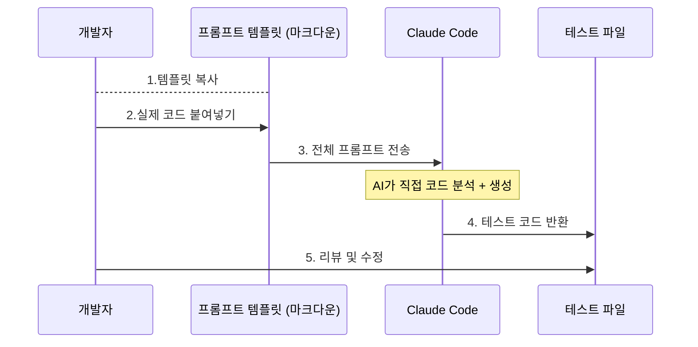
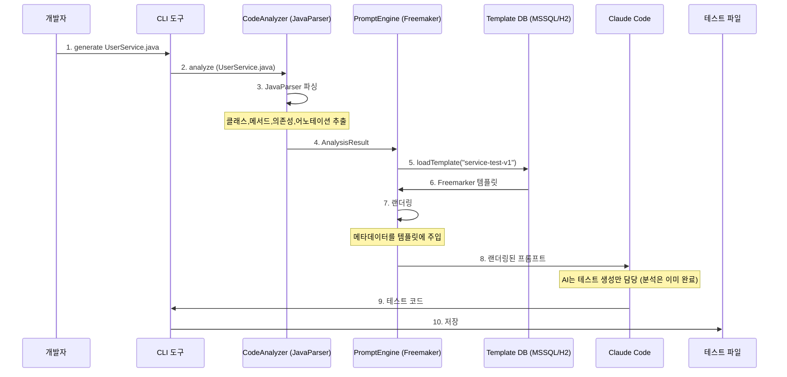
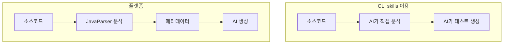

# AI테스트 자동화: 두 가지 구현 전략 비교

> **작성일**: 2026-02-09, 구균모
> **목적**: 기술 접근 방식 이해 및 정리

---

## 1. 배경
### 1.1. 작성 목적
프로젝트 회의 중 **기술 접근 방식에 대한 이해 차이**가 조금 있는것 같아 정리합니다.

이 문서는
- 접근 방식 정확히 이해
- Backend의 초기 계획 설명
- 두 방식의 차이점 객관적 비교
- 최적의 실행 전략 제안

### 1.2. 발견된 간극
**회의 중 느낀점**
"CLI도구를 활용하여 TDD적용..."
"분석 엔진, 프롬프트 엔진을 개발하고 CLI를 이용하여.."

목적은 같으나 구현전략에 대해서 무언거 이야기가 엇갈리는 느낌을 받음

**질문**
- 분석 엔진(CodeAnalyzer), 프롬프트 엔진(PromptEngine)이 왜 필요한가?
- DB는 왜 있지?
- CLI만으로 충분하지 않은가?

---

## 2. 접근 방식 (CLI 스크립트)
### 2.1. 실제 사례 확인: vitest 온보딩 프로젝트

```text
onboading-vitest
- README.md
- 01-PRD-TaskFlow.md
- 02-TRD-TaskFlow.md
- 03-AI-Prompt-Templates.md
- 04-Commit-Schedule.md
- 05-Vitest-Implementation-Plan.md
```

### 2.2. CLI방식 아키텍처


### 2.3. 실제 동작 방식

**프롬프트 예시 (service-test.md)**
```markdown
## 역할
당신은 vue3와 vitest에 전문성을 가진 시니어 프론트엔드 테스트 엔지니어 입니다.

## 컨텍스트
다음은 테스트가 필요한 vue3 컴포넌트 입니다.

```vue
[여기에 코드 붙여 넣기]

## 요구사항
- Props 테스트
- Emit 테스트
...
## 출력형식
describe/it 패턴, 한글 displayName 

## 제약사항
...

```
**개발자가 하는 일**
- TaskList.vue 작성 완료
- service-test.md 템플릿 열기
- [컨텍스트] 부분에 TaskList.vue 코드 복사
- 전체 내용은 Claude Code에 붙여넣기
- AI가 TaskList.spec.js 생성
- 검토 후 저장

### 2.4. 이 방식의 핵심
**AI가 분석/생성 전체를 담당**
AI의 역할:
1. 소스 코드 분석()
2. 규칙 이해 (프롬프트 예시)
3. 테스트 코드 생성

작업자의 역할:
1. 프롬프트 템플릿 작성
2. 생성된 테스트 검토
3. 필요시 수정

**장점**:
- Vue 컴포넌트의 구조에 적용 Good
- 빠른 시작
- 유연한 수정 가능

## 3. 초기 작성했던(PRD) 접근 방식 (springboot 활용)
### 3.1. 아키텍처



### 3.2. 주요 컴포넌트
#### CodeAnalyzer (JavaParser 기반)
**목적**: java소스 코드 일관되게 분석
```java
CodeAnalyzer analyzer = new JavaParserAnalyzer();
AnalysisResult result = analyzer.analyze("UserService.java");
```
result 내용(예시)
```json
{
    "className": "UserService",
    "packageName": "com.nhcard.al.tt.xxx",
    "method": [
      ...
    ],
    "dependencies": [
      ...
    ],
    "annotations": ["@Service", ...]
}
```
**고려한 이유**
1. JavaParser로 분석할 경우 **같은 코드 -> 같은 결과**(일관성)
2. ...java라서

#### PromptEngine (Freemarker 기반)
**목적**: 템플릿을 데이터 기반으로 랜더링

템플릿 적용 예시
```java
PromptEngine engine = new FreemarkerEngine();
String prompt = engine.render("service-test-v1", result);
```
```text
// Freemaker 템플릿 service-test-v1.ftl
다음 service 클래스의 테스트를 생성

클래스: ${className}
패키지: ${packageName}

메소드:
<#list methods as method>
- ${method.name}(${method.parameters}) -> ${mehtod.returnType}
</#list>

의존성:
<#list dependencies as dep>
- #{dep.name} : ${dep.type} (Mock 필요)
</#list>

플랫폼팀 규칙:
- 암호화 확인
============
        
// 랜더링 결과
다음 service 클래스의 테스트를 생성

클래스: UserService.java
패키지: com.nhcard.al.tt.application.service

메서드:
- registerUser(UserRegistrationRequest) -> UserRegistrationResponse
...

의존성:
- userMapper: UserMapper (Mock 필요)
- passwordEncoder: PetraPasswordEncoder (Mock 필요)

플랫폼팀 규칙:
- 암호화 확인
```

**고려한 이유**
1. 템플릿을 데이터기반으로 관리
2. 같은 템플릿을 동일하게 적용

#### Template DB (H2)
**목적**: 프롬프트 템플릿을 관리

**고려한 이유**
1. 모든 템플릿을 중앙 관리
2. 변경 이력 추적
3. 사용 빈도 분석(통계)

### 3.3. 전체 구조
```text
Spring Boot (nh-ai-tdd)
- CodeAnalyzer
- PromptEngine
- Template
- Claude Code Client (Okhttp)
- CLI Interface
- Dashboard/Report
```

**특징**:
- spring boot 서버
- JavaParser, Freemarker 라이브러리
- H2 DB
- 복잡한 아키텍처
- 상당기간 소요

### 3.4. 이 방식의 핵심
- 정확한 분석 + 구조화된 프로젝트
- AI분석 Cost Down 

### 3.5. 작동 방식(안)
#### 방식 1. 독립 실행 JAR
```shell
## 1. jar다운로드 (nexus or 공유폴더)
curl -O http://16.88.127.65:8081/~/nh-ai-tdd-1.0.0.jar

## 2. 실행 (프로젝트 경로만 알면)
java -jar ~/nh-ai-tdd-1.0.0.jar generate \src/main/java/com/application/service/user/IserService.java

## 3. CI/CD
script:
  - java -jar ~/nh-ai-tdd-1.0.0.jar scan --project
```
**구성**:
```text
nh-ai-tdd-1.0.0.jar (독립실행)
- CodeAnalyzer (내장)
- PromptEngine (내장)
- Claude Code Client (내장)
- H2 DB (내장)
- CLI Interface

# 실행시 필요한 것
- JDK 1.8이상 설치
- 프로젝트 import 불필요
- 환경 설정 최소화
```

**설정 파일**:
```yaml
# ~/nh-ai-tdd.yml
claude:
  code:
    url: http://dev-open-webui.nbaihub.nhbank:30001/~
    
output:
  directory: src/test/java

templates:
  default: service-test-v1
```

#### 방식 2. Gradle Plugin
```text
// build.gradle
plugins {
    id 'com.nhcard.nh-ai-tdd' version '1.0.0'
}

// task로 실행
./gradlew generateTests --source=UserService.java
./gradlew scanProject
```

**비교:**
| 항목 | 독립 JAR | Gradle Plugin |
|---|---|---|
| 프로젝트 수정 | 불필요 | build.gradle 수정 |
| 실행 위치 | 어디서든 | 프로젝트 내부 |
| 개발 복잡도 | 낮음 | 높음 |


## 4. CLI스크립트 vs 플랫폼(fat jar 또는 plugin) 간극 
**공통 목표:**
- 테스트 정확성 및 품질 UP
- 개발자의 활용 및 프로젝트 적용이 용이해야 함

### 4.1. '분석'에 대한 차이

**회의시 논의된 진행방향:**
- AI가 소스코드 분석 후 테스트코드 생성
- skills의 markdown.md만 잘 작성해두면 튜닝을 해결

**제가 이해한 진행방향:**
- java를 먼저 분석하고 같은 결과가 나와야 함
- 초기에는 markdown으로 시작하고 결국 DB화하여 템플릿(.md)들을 보유하고 튜닝 

### 4.2. '플랫폼'의 의미 차이

**회의시 논의된 진행방향:**
- 플랫폼?프로젝트 = 프롬프트 템플릿 + 가이드 문서 -> 개발자가 활용하는 지식 체계

**제가 이해한 진행방향:**
- 플랫폼 = 소프트웨어 시스템 -> CodeAnalyzer + PromptEngine + DB

## 5. 비교 분석
동일 목표와 케이스별 비교 분석이 필요함.

### 5.1. 두가지 방식 비교
- CLI방식
  - 수정 반영 빠름 (즉시)
  - 단순 구조에 최적화
  - 빠른시작, 프로토타입 작업에 적합
  - TDD 도입이라는 목표에서는 충분히 적합
- 플랫폼방식
  - 수정 반영 느림 (경우에 따라 어플리케이션 재배포도 필요함)
  - java/spring 구조에 유리
  - 기본 구조분석을 분석기가 수행해서 AI cost는 비교적 적어짐
  - 프로젝트 대상이 확산한다는 가정하에는 플랫폼 방식이 가치가 있어보임(표준화 필수)
  - CI/CD 통합 가능
  - mssql로 전환시 중앙관리 가능 (어떤 패턴이 효과적인지, 템플릿 개선, 피드백 수집 등)