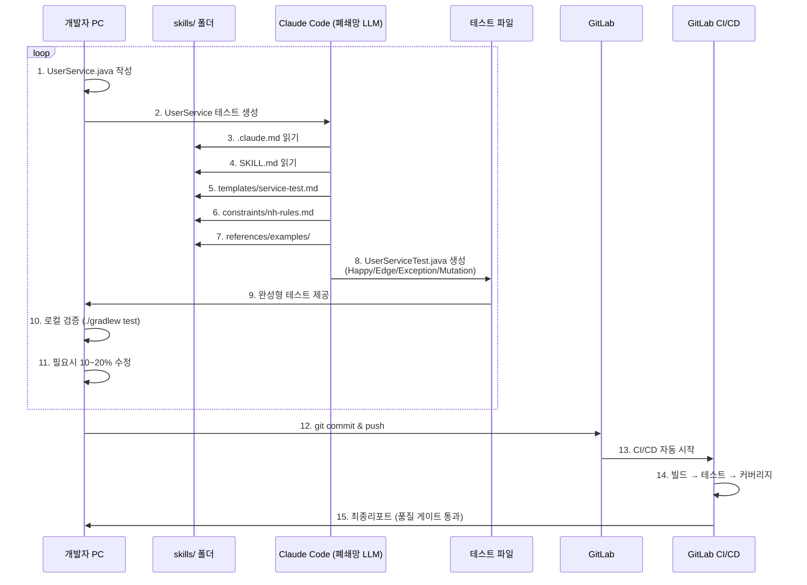
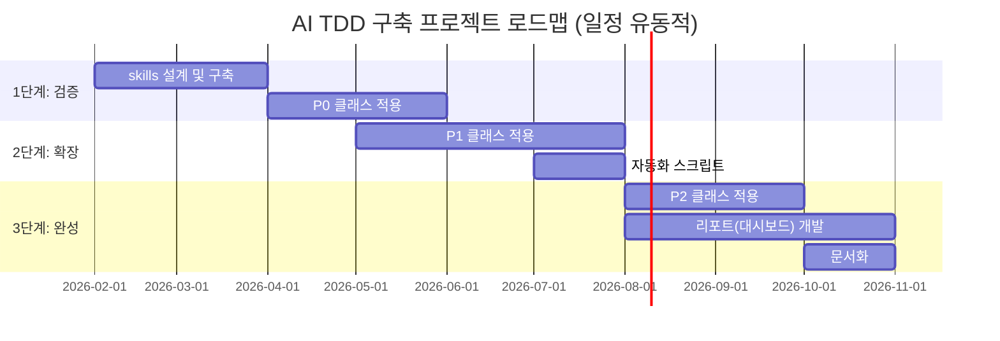

claude# AI기반 TDD환경 구축 프로젝트 기획서 (PRD)

> **최종 수정일**: 2026-02-10

---

## 1. 개요
### 1.1. 프로젝트 개요
**목적**: AI(Claude Code)를 활용한 테스트 자동 생성 체계를 구축한다
Spring 프로젝트 진행시 테스트 작성 부담을 줄이고 코드 품질을 체계적으로 관리하여 
테스트 주도 개발(TDD, Test-Driven Development) 방법론을 쉽게 적용을 할수 있도록 한다.

**범위:**
- Phase 1: 구축 및 로그트래커 적용
- Phase 2: 검증 및 개선
- Phase 3: 도메인 특화 추가 및 고도화 등 

**핵심**:
1. 검증사례: 플랫폼팀 Vitest 온보딩 사례 기반
2. 테스트베드: 로그트래커로 리스크 최소화
3. 보안: Claude Code(2.0.74) 실행 후 mcp tool 활용하여 내부 LLM 활용
4. 공통화 설계: 재사용 가능한 skills/ 체계 구축

### 1.2. 프로젝트 정의
- 프로젝트: AI기반 TDD 환경 구축 프로젝트
- 기간: 2026-02~
- 테스트베드: 로그트래커 프로젝트
- 최종목표: Spring 프로젝트 공통 AI-TDD 구축

### 1.3. 테스트베드 선정
**로그트래커**
- 내부 프로젝트: 부담 없음
- 적절한 규모 + 다양한 패턴(Controller+Service+Mapper)
- 간단한(CRUD) 로직부터 복잡한(TOKEN) 로직까지 포함

---

## 2. 배경
### 2.1. 현황 및 문제점
**문제 1**: 개발단계 테스트 부족
- 평균 테스트 커버리지 > 운영 배포전 커버리지 확인
- 테스트 작성 시간 부족 + 테스트 가치 인식 부족
- 품질 검증이 주로 QA팀 의존

**문제 2**: 수동 테스트의 한계
- 엣지 케이스 놓침
- 반복 작업 부담
- 유지보수 어려움

**문제 3**: 배포 후 버그 발생
- 운영 단계 발견하는 케이스

**문제 4**: 레거시 코드 개선 어려움
- 테스트 없는 레거시 코드
- 수정 시 영향 범위 파악 불가
- 리팩토링 부담 -> 기술 부채 누적

### 2.2. 추진 필요성
1. 품질 향상: 체계적인 테스트로 버그 조기 발견
2. 생산성 향상: 테스트 작성 시간 단축
3. 기술 경쟁력: AI기술 활용 역량 확보
4. 비용 절감: 운영 버그 감소로 유지보수 비용 절감

---

## 3. 프로젝트 목표
### 3.1. 적용 목표

#### 테스트베드 적용 단계 (로그트래커 완전 적용)


**1단계: 검증 (2~4월)**
| 항목 | 목표 | 의미 |
| --- | --- | --- |
| skills/ 구축 | 공통 체계 완성 | 재사용 가능한 구조 |
| 적용 | P0 선정 클래스 | 핵심 기능 검증 |
| 테스트 | 클래스 * 10개 | 품질 확인 |
| 커버리지 | 60% | 실질 검증 |

* 커버리지의 경우 고민 필요: 운영 반영전 검증단계에서 100%에 가깝게 체크 중 → 처음부터 목표를 100%??

**2단계: 확장 (5~7월)**
| 항목 | 목표 | 의미 |
| --- | --- | --- |
| 적용 확대 | P0+P1 | 중요 클래스 완료 |
| 테스트 | 클래스 * 10개 | 핵심+중요 영역 |
| 자동화 | CLI 스크립트 | 편의성 향상 |

**3단계: 완성 (8~10월)**
| 항목 | 목표 | 의미 |
| --- | --- | --- |
| 전체 적용 | P2 | 테스트베드 전체 완료 |
| 테스트 | 클래스 * 10개 | 전체 품질 관리 |
| 리포트(대시보드) | - | 시각화 |
| 문서화 | 완료 | - |

#### 프로젝트 확대 적용: 미정(계획 없음)


### 3.2. 측정 기준

**정량적 기준 (간단명료하게)**
- [ ] 로그트래커 테스트 00개 생성 성공
    - 측정: Junit 리포트 파일 개수
- [ ] 개발자가 AI 생성 코드를 80% 이상 그대로 사용
    - 측정: 수정 비율 추적
- [ ] Clude Code LLM 완전 구동
    - 측정: 생성 소스 수동 체크

**정성적 기준**
- [ ] 자체 AI TDD 구축
    - 기술 내제화 (프롬프트 템플릿, 자체 CLI도구 등)
    - AI테스트 생성 베스트 프랙티스
- [ ] 개발자 테스트 작성 역량 향상
    - 기능에 대한 품질 향상
    - 리팩토링 역량
- [ ] TDD 문화 확산
    - 개발프로세스 변화
        - before : 기능개발 → 수동 테스트 → QA 전달 → 버그 수정
        - after : 기능개발 → AI테스트 생성(시간단축) → 로컬 검증 → QA 전달 → 버그 수정(비율↓)
    - 코드리뷰 기준 변화
        - before : 기능 동작 확인, 코딩컨벤션 확인
        - after : 기능 동작 확인, 코딩컨벤션 확인 + 테스트 코드 존재 확인, 결과 리포트 확인
    - 신규 프로젝트에 TDD방법론 쉽게 적용

---

## 4. 추진 방안
### 4.1. 실제 개발 워크플로우



**단계별 상세**
```text
Step 1-2: 개발 시작
- UserService.java 작성 완료
- Claude Code에 "UserService 테스트 생성" 요청

Step 3-7: 자동 참조
- ./claude.md: 프로젝트 설정 읽기
- SKILL.md: 생성 가이드 읽기
- Service 판단 → service-test.md 선택
- 자체 규칙(rule) 적용
- 예시 코드 참조

Step 8-9: 완성된 테스트 생성
- UserServiceTest.java 자동 생성
- Happy Case (40%)
- Edge Case (30%)
- Exception (20%)
- Mutation Testing (10%)

Step 10-11: 검증
- ./gradlew test (로컬)
- 필요시 수정

Step 12-15: 완료
- CI/CD
- 테스트/커버리지 미 충족시 reject ??
```

### 4.2. 개발 범위

**skills/ 폴더 공통 체계**

```text
nh-ai-tdd-skills/
├─ .claude.md        → 프로젝트별 커스터마이징: 프로젝트 정보만 수정하여 즉시 적용
│
├─ SKILL.md          → 공통 생성 가이드
│  ├─ 4단계 레벨 (Happy/Edge/Exception/Mutation)
│  ├─ 자동 참조 로직
│  └─ 검증 방법
│
├─ templates/        → 공통 테스트 템플릿
│  ├─ service-test.md         (Spring Boot service)
│  ├─ controller-test.md      (REST Controller)
│  ├─ mapper-test.md          (Mybatis Mapper)
│  └─ util-test.md            (유틸리티)
│
├─ constraints/      → 공통 규칙
│  ├─ nh-rules.md             (농협 공통 규칙)
│  ├─ test-coverage.md        (커버리지 기준)
│  ├─ naming-conventions.md   (네이밍 표준)
│  └─ code-style.md           (코딩 스타일)
│
├─ references/       → 공통 참고자료
│  ├─ patterns/               (테스트 패턴)
│  ├─ guides/                 (Spring Boot 테스팅)
│  └─ examples/               (예시 코드)
│
└─ verification/     → 공통 검증
   ├─ compile-check.md
   ├─ test-execution.md
   └─ coverage-report.md
```

**공통화 범위**
| 항목 | 재사용 | 의미 |
| --- | --- | --- |
| SKILL.md | 100% | 모든 프로젝트 공통 |
| templates/ | 100% | Spring Boot 표준 |
| constraints/ | 90% | 농협 공통 |
| references/ | 80% | 프로젝트별 예시 추가 |

### 4.3. 테스트 품질
**4단계 레벨 적용**
- Level 1 (40%): Happy Case
    - 정상 케이스 검증
    - 예: "로그인 성공", "사용자 조회 성공"
- Level 2 (30%): Edge Case
    - Min/Max 값
    - Null/Empty
    - 예: "ID가 Null이면 -> 예외"
- Level 3 (20%): Exception
    - 비즈니스 예외
    - DB 오류
    - 시스템 오류
    - 예: "중복 이메일 -> 예외"
- Level 4 (10%): Mutation Testing
    - 도메인 특화 케이스
    - 숨겨진 버그 패턴
    - 조건문 분기 검증

**로그트레커 도메인 특화**
- 개인정보(주민번호, 카드번호 등) 마스
- Petra 암호화 필수(비밀번호)
- 감사로그 기록 (로그트래커의 경우 메소드 단위로 기록 중)

---

## 5. 기술 스택
### 5.1. 핵심 기술

| 항목 | 기술 | 용도 |
| --- | --- | --- |
| AI Engine | Claude Code | 테스트 코드 생성 |
| 프롬프트 관리 | Markdown (.md) | skills/ 폴더 체계 |
| 테스트 프레임워크 | JUnit | 테스트 실행 |
| Assertion | AssertJ | 가독성 UP |
| Mock | Mockito | Mock 객체 생성 |
| Coverage | JaCoCo | Line/Branch |
| Mutation | PIT | 테스트 품질 |
| CI/DI | GitLab CI | 자동화 파이프라인 |


### 5.2. 환경 구성

**필수환경**
- JDK 1.8
- SpringBoot 2.7.17
- Gradle 6.8.3
- IntelliJ IDEA + Claude Code

**Claude Code**
- qwen3 coder, gpt oss
- 설치 지원(NH)

### 5.3. Claude Code 영향 요소
현재 농협에 있는 Claude Code는 GPToss MCP 서버를 기반으로 작동하며, 이는 다음과 같은 중요한 영향을 미칩니다.

1. **필수 스킬의 영향**: 
   - Claude Code는 시스템 내에서 정의된 필수 스킬들을 반드시 적용함.
   - 이러한 스킬들은 테스트 생성, 코드 리뷰, 문제 해결 등의 작업에 영향

2. **결과 변경 가능성**: 
   - GPToss MCP 서버의 필수 스킬 적용으로 인해, 동일한 입력에 대해 결과가 외부 AI와 다를 수 있음

3. **지속적인 업데이트**: 
   - 스킬 및 규칙이 업데이트되면 TDD 워크플로우의 결과에도 변화가 생길 수 있습니다.
     따라서 워크플로우의 문서화와 테스트 결과 해석 시 이러한 요소를 고려

---

## 6. 추진일정



**Step 1: skills/ 체계 구축 (2-3월)**
- 목표: 재사용 가능한 공통 체계 완성
- 주요 작업:
  - .claude.md 작성 (프로젝트 설정)
  - SKILL.md 작성 (생성 가이드)
  - templates/ 작성 (service, controller, mapper)
  - constraints/nh-rules.md 작성
  - references/examples/ 작성
- 산출물:
  - skills/ 폴더 구조화 v1.0
  - Vitest 온보딩 경험 기반 프롬프트 템플릿

**Step 2: P0 적용 및 검증 (4월)**
- 목표: 핵심클래스 적용
- 주요 작업:
  - AuthService, UserService 등 P0 적용 (서비스에 좀더 집중)
  - 생성 품질 측정
  - 프롬프트(md) 개선
- 산출물:
  - 테스트 파일 생성 결과
  - 검증 완료 리포트

**Step 3: P1 확장 (5-7월)**
- 목표: 중요 클래스 추가
- 주요 작업:
  - Controller, Mapper 적용 (컨트롤러, 맵퍼에 좀더 집중)
  - template/ 더 구체화
  - 자동화 스크립트 (선택사항으로 추가 논의)
- 산출물:
  - skills/ 고도화

**Step 4: P2 완료 및 리포트(대시보드) (8월-10월)**
- 목표: 전체 적용
- 주요 작업:
  - 리포트(대시보드) 선택적 개발
  - 전체 진행사항 문서화 정리
- 산출물:
  - 프로젝트 결과 문서


**일정 유의사항 (실 작업시 월 단위로 조정)**
- skills 설계 및 구축 : **검증 시간** 필요
- 버퍼 시간: 각 단계마다 여유 일정 포함


**주간회의 (매주 수, 10:00)**
- 문제점 및 개선사항 공유
- 다음주 계획 보고