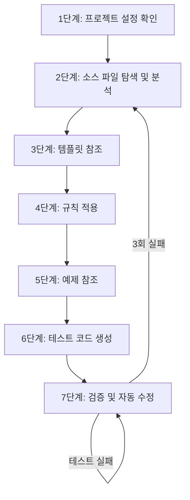
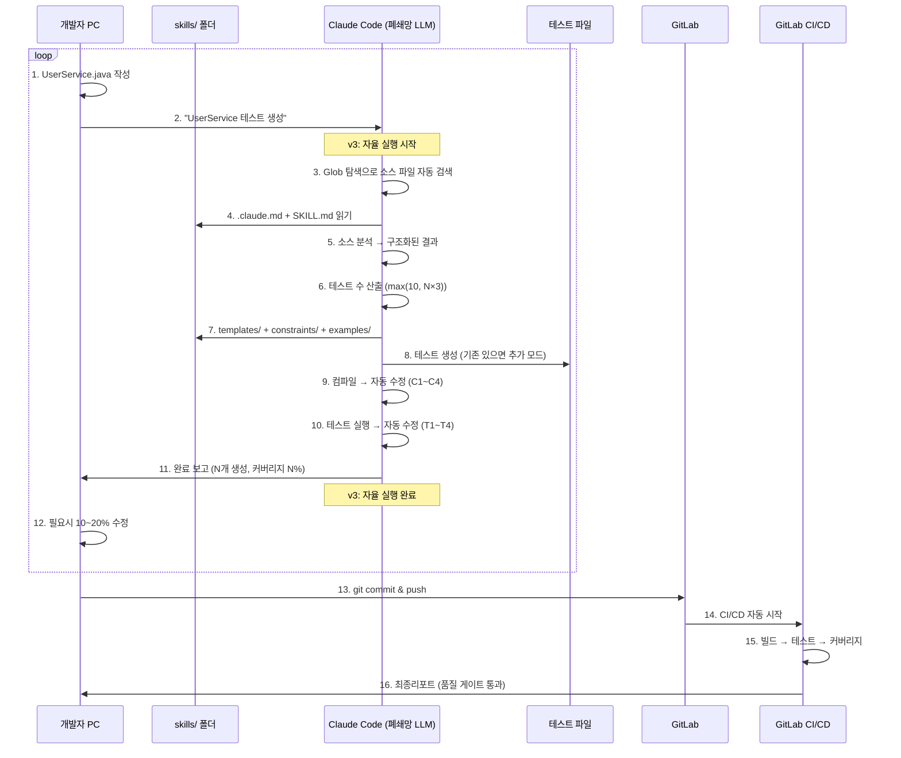

# AI기반 TDD환경 구축 프로젝트 기획서 (PRD) v3

> **최종 수정일**: 2026-02-23
> **이전 버전**: 2026-02-10-prd-ai-tdd.md
> **변경 사유**: AI 에이전트 자율 실행 수준 고도화 (6개 BLOCKING gap 해결)

---

## 1. 개요

### 1.1. 프로젝트 개요

**목적**: AI(Claude Code)를 활용한 테스트 자동 생성 체계를 구축한다.
Spring 프로젝트 진행시 테스트 작성 부담을 줄이고 코드 품질을 체계적으로 관리하여
테스트 주도 개발(TDD) 방법론을 쉽게 적용할 수 있도록 한다.

**범위:**
- Phase 1: 구축 및 로그트래커 적용
- Phase 2: 검증 및 개선
- Phase 3: 도메인 특화 추가 및 고도화

**핵심**:
1. 검증사례: 플랫폼팀 Vitest 온보딩 사례 기반
2. 테스트베드: 로그트래커로 리스크 최소화
3. 보안: Claude Code(2.0.74) 실행 후 mcp tool 활용하여 내부 LLM 활용
4. 공통화 설계: 재사용 가능한 skills/ 체계 구축
5. **자율 실행**: 클래스명 입력만으로 완전 자동화 (v3 신규)

### 1.2. 프로젝트 정의

- 프로젝트: AI기반 TDD 환경 구축 프로젝트
- 기간: 2026-02~
- 테스트베드: 로그트래커 프로젝트
- 최종목표: Spring 프로젝트 공통 AI-TDD 구축

### 1.3. 테스트베드 선정

**로그트래커**
- 내부 프로젝트: 부담 없음
- 적절한 규모 + 다양한 패턴(Controller+Service+Mapper)
- 간단한(CRUD) 로직부터 복잡한(TOKEN) 로직까지 포함

---

## 2. v3 변경 배경

### 2.1. v2(2026-02-10) 대비 변경 사항

**v2 상태**: 문서가 "무엇을 해야 하는지"는 설명하지만, AI 에이전트가 사람의 판단 없이 기계적으로 실행할 수 있는 수준의 알고리즘이 부족했음.

**v3 목표**: 클래스명만 입력하면 → 소스 파일 탐색 → 분석 → 테스트 생성 → 컴파일 → 실행 → 커버리지 확인까지 **완전 자율 실행**.

### 2.2. 발견된 6개 BLOCKING Gap 및 해결

| # | Gap | v2 상태 | v3 해결 |
|---|---|---|---|
| B1 | 소스 파일 검색 | "프로젝트 내에서 검색한다" (구체 방법 없음) | Glob 패턴 + 패키지 필터 + 5단계 탐색 알고리즘 |
| B2 | 테스트 수 산출 | "40/30/20/10 비율" (총 수가 없음) | 공식: `max(10, public_methods × 3)` → 레벨별 분배 |
| B3 | 파라미터 → 테스트 매핑 | "null, empty, 경계값" (어떤 타입에 뭘?) | 타입별 Edge Case 매트릭스 (String/Long/Object/List/Date) |
| B4 | 소스 메서드 → 테스트 코드 | 템플릿만 있고 변환 알고리즘 없음 | 반환 타입별 어설션 패턴 + 구조화된 분석 결과 포맷 + @DisplayName 생성 규칙 |
| B5 | 기존 테스트 처리 | "사용자에게 확인한다" (자율 아님) | 자동 감지 + 기본 동작(추가 모드) 정의 |
| B6 | 에러 복구 | "참조하여 수정" (어떻게?) | 인라인 에러 패턴 4+4개 + 자동 수정 의사결정 트리 |

### 2.3. 변경 파일 목록

| 파일 | 변경 유형 | 변경 내용 |
|---|---|---|
| `ai-tdd-agent/SKILL.md` | 대규모 변경 | B1~B6 전체 알고리즘 추가 |
| `ai-tdd-skills/SKILL.md` | 중규모 변경 | 상세 매핑 테이블 (섹션 3 신규) |
| `templates/service-test.md` | 보강 | 생성 알고리즘 섹션 추가 |
| `templates/controller-test.md` | 보강 | 생성 알고리즘 섹션 추가 |
| `templates/mapper-test.md` | 보강 | 생성 알고리즘 섹션 추가 |
| `templates/util-test.md` | 보강 | 생성 알고리즘 섹션 추가 |

**변경하지 않은 파일**: `constraints/`, `verification/`, `references/examples/`, `.claude.md`, `document-guide.md`
→ 이미 충분히 상세하여 변경 불필요

---

## 3. 자율 실행 프로세스

### 3.1. v2 vs v3 실행 흐름 비교

**v2 (사람 개입 필요)**
```
개발자: "UserService 테스트 생성"
  → AI: 파일 어디있나요? (사람 판단)
  → AI: 테스트 몇 개 만들까요? (사람 판단)
  → AI: null인 경우 뭘 테스트할까요? (사람 판단)
  → AI: 기존 테스트 있는데 어떻게 할까요? (사람 판단)
  → AI: 컴파일 에러인데 어떻게 고칠까요? (사람 판단)
```

**v3 (완전 자율)**
```
개발자: "UserService 테스트 생성"
  → AI: Glob으로 파일 탐색 (B1 알고리즘)
  → AI: 소스 분석 → 구조화된 결과 (B4 포맷)
  → AI: max(10, 4×3)=12개 테스트 산출 (B2 공식)
  → AI: Long→null,0,-1 / String→null,"" 자동 적용 (B3 매트릭스)
  → AI: 기존 테스트 감지 → 누락분만 추가 (B5 로직)
  → AI: 컴파일/테스트 오류 → 의사결정 트리로 자동 수정 (B6)
  → AI: "완료! 기존 5개 + 신규 7개 = 총 12개, 커버리지 85%"
```

### 3.2. 자율 실행 7단계 상세



| 단계 | v3 자율 실행 알고리즘 | 사람 개입 |
|---|---|---|
| 1단계 | `.claude.md` 자동 읽기 | 없음 |
| 2단계 | Glob 5단계 탐색 + 구조화된 분석 결과 | 파일 2건 이상 시에만 선택 요청 |
| 3단계 | 어노테이션 기반 유형 판별 → 템플릿 자동 선택 | 없음 |
| 4단계 | 우선순위 순서대로 규칙 자동 적용 | 없음 |
| 5단계 | 유형별 예제 자동 참조 | 없음 |
| 6단계 | 테스트 수 공식 + 타입별 매트릭스 + 반환 타입별 패턴 적용 | 없음 |
| 7단계 | 의사결정 트리(C1~C4, T1~T4)로 오류 자동 수정 | 3회 이상 실패 시에만 보고 |

### 3.3. 핵심 알고리즘 요약

#### 소스 파일 탐색 (B1)

```
1. Glob: src/main/java/**/{ClassName}.java
2. 0건 → src/main/**/{ClassName}.java
3. 2건+ → .claude.md 기본 패키지로 필터
4. 여전히 2건+ → 사용자에게 목록 제시
5. 0건 → "찾을 수 없습니다" 보고 후 중단
```

#### 테스트 수 산출 (B2)

```
총 테스트 수 = max(10, public_methods × 3)
  Level 1 = public_methods
  Level 3 = throw_statements
  Level 4 = max(2, domain_checks)
  Level 2 = 총 - L1 - L3 - L4
```

#### 에러 자동 수정 (B6)

```
컴파일 오류:
  C1: cannot find symbol → import 추가
  C2: incompatible types → Mock 반환값 타입 수정
  C3: package does not exist → import 경로 수정
  C4: method does not override → 시그니처 재대조

테스트 실패:
  T1: NullPointerException → when() 설정 추가
  T2: AssertionError → 기대값 수정
  T3: UnnecessaryStubbingException → 불필요 when() 제거
  T4: InvalidUseOfMatchersException → Matcher 통일
```

---

## 4. 기존 PRD 내용 (유지)

> 아래 내용은 v2(2026-02-10) PRD에서 변경 없이 유지되는 항목입니다.

### 4.1. 배경 및 문제점

**문제 1**: 개발단계 테스트 부족
- 평균 테스트 커버리지 > 운영 배포전 커버리지 확인
- 테스트 작성 시간 부족 + 테스트 가치 인식 부족
- 품질 검증이 주로 QA팀 의존

**문제 2**: 수동 테스트의 한계
- 엣지 케이스 놓침
- 반복 작업 부담
- 유지보수 어려움

**문제 3**: 배포 후 버그 발생
- 운영 단계 발견하는 케이스

**문제 4**: 레거시 코드 개선 어려움
- 테스트 없는 레거시 코드
- 수정 시 영향 범위 파악 불가
- 리팩토링 부담 -> 기술 부채 누적

### 4.2. 추진 필요성

1. 품질 향상: 체계적인 테스트로 버그 조기 발견
2. 생산성 향상: 테스트 작성 시간 단축
3. 기술 경쟁력: AI기술 활용 역량 확보
4. 비용 절감: 운영 버그 감소로 유지보수 비용 절감

### 4.3. 적용 목표

**1단계: 검증 (2~4월)**
| 항목 | 목표 | 의미 |
|---|---|---|
| skills/ 구축 | 공통 체계 완성 | 재사용 가능한 구조 |
| 적용 | P0 선정 클래스 | 핵심 기능 검증 |
| 테스트 | 클래스 * 10개 | 품질 확인 |
| 커버리지 | 60% | 실질 검증 |

**2단계: 확장 (5~7월)**
| 항목 | 목표 | 의미 |
|---|---|---|
| 적용 확대 | P0+P1 | 중요 클래스 완료 |
| 테스트 | 클래스 * 10개 | 핵심+중요 영역 |
| 자동화 | CLI 스크립트 | 편의성 향상 |

**3단계: 완성 (8~10월)**
| 항목 | 목표 | 의미 |
|---|---|---|
| 전체 적용 | P2 | 테스트베드 전체 완료 |
| 테스트 | 클래스 * 10개 | 전체 품질 관리 |
| 리포트(대시보드) | - | 시각화 |
| 문서화 | 완료 | - |

### 4.4. 측정 기준

**정량적 기준**
- [ ] 로그트래커 테스트 00개 생성 성공
- [ ] 개발자가 AI 생성 코드를 80% 이상 그대로 사용
- [ ] Claude Code LLM 완전 구동
- [ ] **v3 추가**: 자율 실행 성공률 90% 이상 (사람 개입 없이 완료)

**정성적 기준**
- [ ] 자체 AI TDD 구축
- [ ] 개발자 테스트 작성 역량 향상
- [ ] TDD 문화 확산
- [ ] **v3 추가**: 클래스명 입력만으로 테스트 생성 가능 (자율 실행 체험)

### 4.5. 개발 워크플로우



---

## 5. 기술 스택 (유지)

### 5.1. 핵심 기술

| 항목 | 기술 | 용도 |
|---|---|---|
| AI Engine | Claude Code | 테스트 코드 생성 |
| 프롬프트 관리 | Markdown (.md) | skills/ 폴더 체계 |
| 테스트 프레임워크 | JUnit 5 | 테스트 실행 |
| Assertion | AssertJ | 가독성 UP |
| Mock | Mockito | Mock 객체 생성 |
| Coverage | JaCoCo | Line/Branch |
| Mutation | PIT | 테스트 품질 |
| CI/CD | GitLab CI | 자동화 파이프라인 |

### 5.2. 환경 구성

**필수환경**
- JDK 1.8
- SpringBoot 2.7.17
- Gradle 6.8.3
- IntelliJ IDEA + Claude Code

---

## 6. 추진일정

> v2 일정 유지. v3 문서 고도화는 1단계(skills/ 체계 구축) 범위 내에서 완료됨.

**Step 1: skills/ 체계 구축 (2-3월)** ← 현재 단계

| 작업 | 상태 | 비고 |
|---|---|---|
| .claude.md 작성 | 완료 | 프로젝트 설정 |
| SKILL.md 작성 | 완료 | 생성 가이드 |
| templates/ 작성 | 완료 | 4개 계층 템플릿 |
| constraints/ 작성 | 완료 | NH 규칙 포함 |
| references/examples/ 작성 | 완료 | 4개 계층 예제 |
| agent/SKILL.md 작성 | 완료 | 에이전트 행동 지시서 |
| **v3 자율 실행 고도화** | **완료** | **6개 BLOCKING gap 해결** |

**Step 2: P0 적용 및 검증 (4월)**
- 목표: 핵심클래스 적용
- v3 검증: 자율 실행으로 P0 클래스 테스트 생성 시도
- 측정: 사람 개입 횟수, 생성 성공률, 수정 비율

**Step 3: P1 확장 (5-7월)**
- 목표: 중요 클래스 추가

**Step 4: P2 완료 및 리포트(대시보드) (8월-10월)**
- 목표: 전체 적용

---

## 7. v3 검증 방법

수정 완료 후, 다음 시나리오로 문서 품질을 검증합니다.

### 7.1. 시뮬레이션 검증

1. agent/SKILL.md를 처음부터 끝까지 읽으면서 "UserService 테스트 생성" 시나리오를 시뮬레이션
2. 각 단계에서 "에이전트가 사람에게 물어봐야 하는 순간이 있는가?" 확인
3. 소스 분석 결과 → 테스트 코드까지의 변환이 기계적으로 재현 가능한지 확인

### 7.2. 실제 테스트 검증 (P0 적용 시)

| 검증 항목 | 기준 | 측정 방법 |
|---|---|---|
| 자율 실행 완료율 | 90% 이상 | 사람 개입 없이 완료된 비율 |
| 컴파일 성공률 | 첫 시도 70%, 자동 수정 후 95% | 컴파일 결과 |
| 테스트 통과율 | 첫 시도 60%, 자동 수정 후 90% | 테스트 결과 |
| 커버리지 달성 | 라인 80%, 분기 70% | JaCoCo |
| 코드 수정 비율 | 20% 이하 | Git diff |
