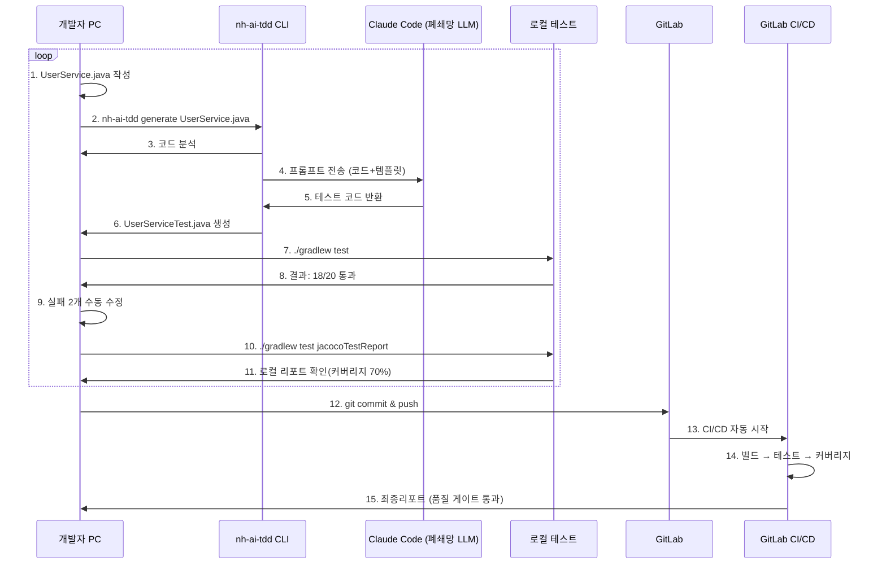
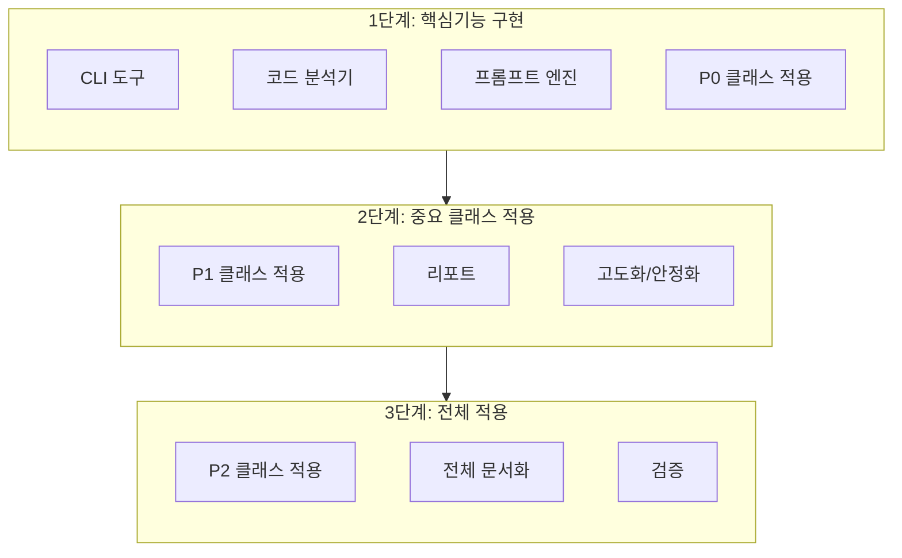
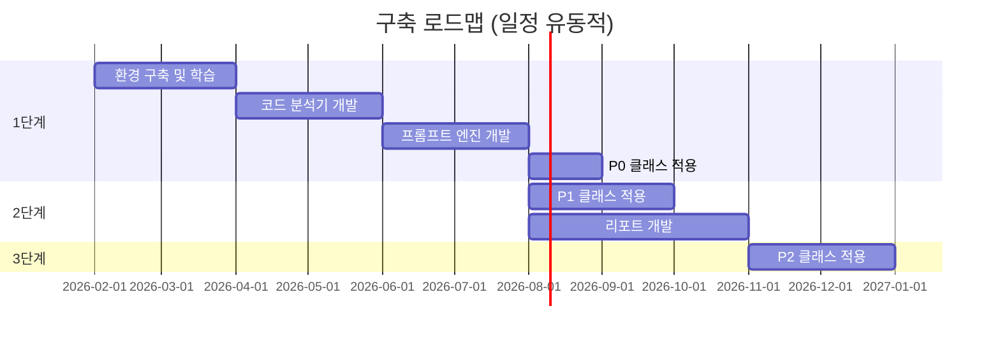

# AI기반 TDD 프로젝트 (PRD)

> **최종 수정일**: 2026-02-04


---

## 1. 개요

### 1.1. 프로젝트 개요

AI를 활용한 자동화된 테스트 주도 개발(TDD, Test-Driven Development) 플랫폼을 구축하여,
Spring Boot 프로젝트의 테스트 작성 부담을 줄이고 코드 품질을 체계적으로 관리

### 1.2. 적용 범위
- Phase 1: 구축 및 로그트래커 적용 (2~7월, 6개월)
- Phase 2: 검증 및 개선 (8~10월, 3개월)
- Phase 3: 도메인 특화 추가 및 고도화 등

### 1.3. 핵심 기능
- 보안: Claude Code 폐쇄망 LLM 활용
- 도메인 특화: 규칙 자동 검증
- 자동화: 프롬프트 기반 테스트 자동 생성
- 검증기능: 측정 가능한 지표 중심

---

## 2. 배경

### 2.1. 현황 및 문제점

**문제 1**: 개발단계 테스트 부족
- 평균 테스트 커버리지 > 운영 배포전 커버리지 확인
- 테스트 작성 시간 부족
- 품질 검증이 주로 QA팀 의존

**문제 2**: 수동 테스트의 한계
- 엣지 케이스 놓침
- 반복 작업 부담
- 유지보수 어려움

**문제 3**: 배포 후 버그 발생
- 운영 단계 발견하는 케이스

**문제 4**: 레거시 코드 개선 어려움
- 테스트 없는 레거시 코드
- 수정 시 영향 범위 파악 불가
- 리팩토링 부담 -> 기술 부채 누적

### 2.2. 추진 필요성

1. 품질 향상: 체계적인 테스트로 버그 조기 발견
2. 생산성 향상: 테스트 작성 시간 단축
3. 기술 경쟁력: AI기술 활용 역량 확보
4. 비용 절감: 운영 버그 감소로 유지보수 비용 절감

---

## 3. 프로젝트 목표


### 3.1. 정량적 목표

| 지표 | 현재 | 목표 | 측정 방법 |
| --- | --- | --- | --- |
| 테스트 커버리지 | - | 70% | JaCoCo |
| Mutation Coverage | 0% | 65% | PIT |
| AI 생성 비율 | 0% | 80% | 자체 집계 |
| 테스트 작성 시간 | - | 10분 | 개발자 피드백 |
| 개발 단계 버그 발견 | 50% | 70% | 버그 트래킹 |
| 운영 버그 | - | 5% | 운영 로그 |

**성공기준 (간단명료하게)**
- [ ] 로그트래커 테스트 00개 생성 성공
    - 측정: Junit 리포트 파일 개수
- [ ] 개발자가 AI 생성 코드를 80% 이상 그대로 사용
    - 측정: Git diff 분석, 수정 비율 추적
- [ ] Clude Code 폐쇄망 LLM 완전 구동
    - 측정: 생성 소스 수동 체크


### 3.2. 정성적 목표

- 자체 AI TDD 구축
    - 기술 내제화 (프롬프트 템플릿, 자체 CLI도구 등)
    - AI테스트 생성 베스트 프랙티스
- 개발자 테스트 작성 역량 향상
    - 기능에 대한 품질 향상
    - 리팩토링 역량
- TDD 문화 확산
    - 개발프로세스 변화
        - before : 기능개발 → 수동 테스트 → QA 전달 → 버그 수정
        - after : 기능개발 → AI테스트 생성(시간단축) → 로컬 검증 → QA 전달 → 버그 수정(비율↓)
    - 코드리뷰 기준 변화
        - before : 기능 동작 확인, 코딩컨벤션 확인
        - after : 기능 동작 확인, 코딩컨벤션 확인 + 테스트 코드 존재 확인, 결과 리포트 확인
    - 신규 프로젝트에 TDD방법론 쉽게 적용

---

## 4. 구현 전략

**기본 작업 구조**
``` plain text
[개발자PC]
├ IntelliJ IDEA
├ Claude Code CLI
└ 코드 작성 → AI 테스트 생성
    ↓
[내부 GitLab]
├ 테스트 코드 저장
├ CI/DI 자동 실행
└ 리포팅
```


### 4.1. 실제 워크플로우



### 4.2. 개발 범위



**작업 예상**
- CLI 도구
- 코드분석기: CLI
- 프롬프트엔진: CLI
- 템플릿 저장소: 프롬프트 관리
- GitLab CI: pipeline
- 리포트

### 4.3. 구축 순서 (로드맵)


#### 4.3.1. 일정 유의사항 (실 작업시 월 단위로 조정)
- 학 습곡선 고려: Claude Code, JavaParser 등
- 환경 설정: LLM 및 **검증 시간** 필요
- 협의 사항: 방화벽/보안 승인 등 외부 요인
- 버퍼 시간: 각 단계마다 여유 일정 포함

### 4.4. 테스트 품질 보장 전략

#### 4.4.1. 4단계 레벨 적용

- Level 1 (40%): 기본 테스트
    - 정상 케이스 (Happy Path)
    - 기본 CRUD
- Level 2 (30%): 경계값 테스트
    - Min/Max 값
    - Null/Empty
    - 데이터 타입 경계
- Level 3 (20%): 예외 테스트
    - 비즈니스 예외
    - DB 오류
    - 보안 예외
- Level 4 (10%): AI 엣지 케이스
    - Mutation Testing 기반 -> *AI가 놓친 테스트를 Mutation Testing으로 찾기
    - 도메인 특화 케이스
    - 숨겨진 버그 패턴

#### 4.4.2. 농협 도메인 특화

- 개인정보(주민번호, 카드번호 등) 마스킹
- Petra 암호화 필수
- 감사로그 기록 (로그트래커의 경우 메소드 단위로 기록 중)
- 기타: 필수로 확인해야 하는것들 추가 체크

### 4.5. 품질 검증 프로세스

- 1단계: AI 테스트 생성
- 2단계: 개발자 리뷰
- 3단계: 테스트 실행 (Junit)
- 4단계: 커버리지 측정 (JaCoCo)
- 5단계: Mutation Testing (PIT)
- 6단계: 추가 테스트 생성 (AI)
- 7단계: 최종 검증 (CI/DI)

---

## 5. 기술 스택

### 5.1. 개발 환경

| 구분 | 기술 | 버전 | 비고 |
| --- | --- | --- | --- |
| 언어 | Java | 1.8 | 기존 환경 호환 |
| 프레임워크 | SpringBoot | 2.7.17 | |
| 빌드 도구 | Gradle | | 빌드 자동화 |
| 데이터베이스 | MSSQL/H2 또는 추가 | | 메타데이터 저장 |
| VCS | GitLab | - | 버전관리 |

### 5.2. 핵심 기술

| 항목 | 기술 | 용도 |
| --- | --- | --- |
| AI API | Claude | 테스트 코드 생성 |
| 코드 분석 | JavaParser | Java 소스 파싱 |
| 템플릿 | Freemarker | 프롬프트 생성 |
| 테스트 | JUnit | 단위 테스트 |
| 커버리지 | JaCoCo | Line/Branch |
| Mutation | PIT | 테스트 품질 |
| CI/DI | GitLab CI | 자동화 파이프라인 |
| 리포팅 | 오픈소스 또는 자체 구현 | 대시보드 |

---

## 6. 추진일정
`로드맵 참고`

### 6.1. 1단계 (2~7월)
**2M: 환경구축 및 학습(유동적)**
- 목표: Claude Code 연결 및 기본 환경 구축
- 주요 작업:
    - Claude Code LLM 연결 및 검증
    - JavaParser 학습/테스트
    - 로그트래커(Spring Boot) 프로젝트 적용
    - 기본 설계 및 프로토타입
- 예상 변수:
    - AI 품질
    - 환경 설정
- 산출물: 개발 환경, 프로토타입

**3M: 플랫폼 개발(집중 개발)**
- 목표: CLI 도구 완성
- 주요 작업:
    - 코드분석기 개발
    - 프롬프트엔진 개발
    - Claude Code API 연동
    - CLI 명령어 구현
    - 템플릿 저장소 구축(협의)
- 예상 변수:
    - 기술적 난이도

**1M: P0 클래스 적용**
- 목표: 가장 중요한 클래스 테스트 생성
- 주요작업:
    - 대상: P0
    - 테스트: 00개
- 산출물: 적용 사례, 결과 정리

### 6.2. 2단계 (8~10월)
**3M: P1클래스 적용 + 리포트(대시보드)**
- 목표: 중요 클래스 확대 적용
- 주요작업:
    - 리포트(결과물)
    - P1대상 작업
    - 테스트: 누적

### 6.3. 3단계 (11~12월)
**2M: 프로젝트 전체 적용**
- 목표: 프로젝트 전체 적용
- 주요작업:
    - 리포트(결과물)
    - P2대상 작업
    - 테스트: 누적
- 산출물: 최종 문서, 적용 가이드

---
